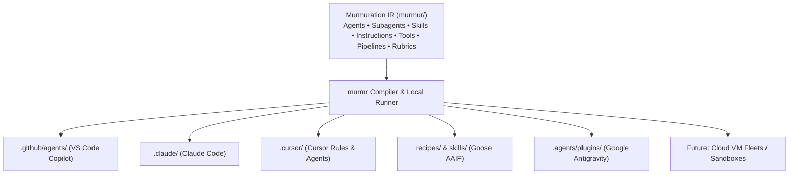

# 🐦‍⬛ Murmuration (`murmr`)

> A tool-agnostic, packageable multi-agent + subagent framework you can drop into **any** project.
> Generic agents. Specialized subagents. All knowledge sourced from **skills** and **instructions** — never hard-coded into the agents themselves.

A *murmuration* is thousands of starlings moving as a single, coordinated intelligence — **no central controller, emergent behavior from simple shared rules.** That's the design philosophy: a small set of generic agents, a master agent that spawns specialized subagents on demand, and a shared substrate of skills/instructions that gives them context.

> **Status:** ✅ v0.4 shipped. Defines and compiles agents/subagents/skills/instructions/tools/pipelines, with selective dispatch tables (`invokeWhen`/`skipWhen`), full domain-critic roster, multi-target compilation (GitHub Copilot, goose, Google Antigravity, Claude Code, Cursor), `watch`, `hook`, `tool`, `docs`, `doctor --fix`, `classify`, and a defense-in-depth `publish` scrubber.

---

## Architecture: The Universal Agent IR vs. Cloud Sandboxes

A critical question in modern agentic AI is how developer workflows should be organized:

- **Cloud VM Fleets (e.g. Macroscope Murmur, Devin, Factory):** Infrastructure-heavy hosted platforms that spin up remote VMs, duplicate repositories into cloud sandboxes, and run proprietary orchestrators. While useful for long-running headless cloud tasks, they introduce vendor lock-in, recurring infrastructure bills ($500+/mo), and closed proprietary formats.
- **Murmuration (`murmr`):** An open-source, local-first **universal compiler and specification layer**. You author your multi-agent team, specialist subagents, skills, instructions, rubrics, and pipelines once in human-readable Markdown/YAML inside version control (`murmur/`). From there, `murmr` compiles native configurations into whatever tool your team actually uses — VS Code Copilot, Claude Code, Cursor, Goose, or Google Antigravity.



**Why this distinction matters:**
1. **Zero Lock-In:** You own your agent architectures in git. If your team switches from Cursor to Claude Code or Copilot tomorrow, simply run `murmr compile`.
2. **Local-First & Fast:** Runs directly on your machine with whatever LLM keys or local host tools you already have. No remote sandbox provisioning lag or subscription gates.
3. **Enforced Knowledge Externalization:** Project facts live strictly in inspectable skills and instructions. Agent personas remain generic, pure, and reusable across projects.
4. **Upstream Authoring Layer:** Even if you use cloud sandboxes for execution, `murmr` serves as the portable, version-controlled source of truth for agent specifications.

---

## Why this exists

Most agent setups bake project-specific knowledge directly into agent prompts, making them non-portable. Murmuration inverts that:

- **Agents stay generic and reusable.** A `master`, an `implementer`, a `researcher`, a `critic` — none of them know anything about *your* codebase.
- **Context lives in skills & instructions.** Project-specific knowledge is generated into portable skill/instruction files that any agent can pull in.
- **A master agent spawns subagents on demand.** When a task needs a specialist that doesn't exist yet, the master agent creates one — scoped, disposable, isolated-context.
- **An `init` workflow auto-generates skills + instructions from your codebase** by reading it with whatever host agent you're already running (Copilot, Claude Code, goose, etc.) — no extra API key required.
- **Selective dispatch matrices route tasks precisely.** Agents declare `invokeWhen`, `skipWhen`, and `tasks` metadata, matched semantically via `murmr classify`.
- **One package, any project.** Install via `bunx murmr init` and it scaffolds the right files for your runtime.

---

## Core concepts

| Concept | Role |
|---|---|
| **Master agent** | Orchestrates. Decomposes tasks, delegates to subagents, spawns *new* subagents when no existing specialist fits. |
| **Generic agents** | Portable, codebase-agnostic roles (`implementer`, `researcher`, `analyst`, `planner`, `curator`, `verifier`). |
| **Domain critics** | Objective evaluation specialists (`critic`, `business-critic`, `data-critic`, `social-critic`, `research-critic`, `fact-checker`). |
| **Subagents** | Narrow specialists, often spawned on demand, with isolated context. |
| **Skills** | Packaged domain knowledge the agents read on demand (the *what to know*). |
| **Instructions** | Rules/conventions scoped via `applyTo` globs (the *how to behave*). |
| **Pipelines & Rubrics** | Governed multi-phase workflows (`murmr run`) with quantitative scoring gates (`murmr score`). |
| **`init` generator** | Reads your codebase via the host agent and emits the skills + instructions that make the generic agents project-aware. |
| **Compiler** | Translates the abstract agent/skill/instruction definitions into each runtime's native format. |

---

## Base Agent Roster (14 Generic Roles)

Murmuration ships with a batteries-included library of codebase-agnostic agents:

| Category | Agents | Responsibility |
|---|---|---|
| **Coordination** | `master` | Task decomposition, specialist delegation, on-demand subagent spawning. |
| **Strategy & Design** | `architect`, `planner`, `prompt-engineer` | Multi-phase architectural planning, prompt refinement, refinement synthesis. |
| **Execution** | `implementer`, `analyst`, `curator` | Step-by-step code implementation, codebase analysis, knowledge base maintenance. |
| **Research & Fact Checking** | `researcher`, `fact-checker`, `verifier` | Open information gathering, primary source verification, implementation audit. |
| **Domain Critics** | `critic`, `business-critic`, `data-critic`, `social-critic`, `research-critic` | Multi-perspective adversarial review (technical, unit economics, statistical rigor, accessibility/welfare, academic rigor). |

---

## Tool-agnostic by design

Agents, skills, and instructions are authored once in an abstract format and **compiled** into each runtime's native layout:

| Runtime | Compiles to |
|---|---|
| Google Antigravity | `.agents/plugins/<name>/`, `plugin.json`, `agents/`, `skills/`, `rules/`, `AGENTS.md` |
| VS Code Copilot | `.github/agents/*.agent.md`, `*.instructions.md`, `SKILL.md` |
| goose (AAIF) | `recipes/*.yaml`, root-level `skills/`, `.goosehints`, `AGENTS.md` |
| Claude Code | `.claude/agents/*.md`, `CLAUDE.md`, `.claude/skills/`, `.claude/rules/` |
| Cursor | `.cursor/rules/*.mdc`, `.cursor/agents/*.md`, `.cursor/skills/`, `AGENTS.md` |
| ACP (Agent Client Protocol) | `.acp/manifest.json`, `.acp/agents/*.json`, `.acp/server.ts` ([agentclientprotocol.com](https://agentclientprotocol.com/)) |

`AGENTS.md` is treated as the universal lowest-common-denominator manifest.

---

## How it compares

| Capability | Single-Agent Extensions (Copilot) | Local Runtimes (Claude Code, Goose) | Cloud VM Fleets (Devin, Macroscope) | **Murmuration (`murmr`)** |
|---|---|---|---|---|
| **Architecture layer** | IDE extension | CLI process | Cloud infrastructure / VMs | **Universal Compiler & IR** |
| **Multi-runtime portability** | ❌ (VS Code only) | ⚠️ (Single host) | ❌ (Proprietary cloud) | ✅ (Compiles to 6 runtimes: Copilot, Goose, Antigravity, Claude, Cursor, ACP) |
| **Subagents with isolated context** | ❌ | ⚠️ (Tool-limited) | ✅ (Per-VM) | ✅ (Native schema & compiler) |
| **On-demand subagent spawning** | ❌ | ❌ | ❌ | ✅ (Master-agent spawn loop) |
| **Enforced knowledge externalization** | ❌ | ⚠️ | ❌ | ✅ (Automated CI gate) |
| **Governed pipelines & rubrics** | ❌ | ⚠️ (Basic scripts) | ⚠️ (Server workflows) | ✅ (`murmr run` & `murmr score`) |
| **Selective dispatch & task classification** | ❌ | ❌ | ⚠️ | ✅ (`murmr classify` + dispatch tables) |
| **Execution isolation** | Local process | Local process | Proprietary cloud VMs | ✅ Local worker pool + Docker / Remote Cloud Sandbox (`murmr run --sandbox`) |
| **Cost & infrastructure footprint** | Low ($10–20/mo) | Direct API usage | High ($500+/mo cloud VMs) | **Free, open-source & local** |

---

## Install & quick start

No install required — run it straight from the registry with `bunx`:

```bash
# In any project directory:
bunx murmr init                  # analyze the codebase → agents + skills + instructions
bunx murmr compile --target agy  # or: copilot, goose
bunx murmr doctor --fix          # validate and self-heal missing references
```

Or install it for repeated use:

```bash
bun add -g murmr                 # global
# or, as a dev dependency in a project:
bun add -d murmr
```

> Installs two equivalent commands: **`murmr`** and the shorter **`mrmr`** — use whichever you prefer.

The goal: **anyone runs one command in any codebase and gets it ready for any
multi-agent / agent-swarm workflow** — with auto-generated context (skills +
instructions today; tools and pipelines on the [roadmap](docs/ROADMAP.md)) that
compiles to whatever runtime they use.

---

## CLI

```bash
# Project level
murmr init [--tools]               # analyze codebase → generate skills + instructions + agents
murmr add agent <name>             # scaffold a new generic agent
murmr add subagent <name>          # scaffold a specialist subagent
murmr add skill <name>             # scaffold a skill
murmr add instruction <name>       # scaffold a scoped instruction
murmr add tool <name>              # scaffold a typed tool / MCP definition
murmr compile --target agy|copilot|goose|claude|cursor
murmr watch [--target <id>]        # real-time recompiler daemon with debounced change detection
murmr hook install                 # install Git pre-commit verification hook (.git/hooks/pre-commit)
murmr hook status                  # check status of Git pre-commit hook
murmr tool discover [--write]      # auto-discover package scripts/tools & generate tool skills
murmr docs [--out <dir>] [--serve] # compile interactive HTML documentation portal with live preview
murmr run <pipeline> [--tier T]    # walk a pipeline with interactive progress UI; emits RUN-LOG
murmr score <doc> --rubric <name>  # score a document against quantitative rubrics
murmr classify "<task description>" # classify task & select agent roster
murmr doctor [--fix]               # validate & self-heal missing references
murmr list                         # inventory the murmur/ IR
murmr publish [--dry-run] [--strict] # strip codebase-specific context for sharing
```

---

## Publishing hygiene

Before this repo (or any derived agent pack) is published, **all codebase-specific context is stripped** — `murmr publish` scrubs generated skills/instructions of project-identifying details (repo name, paths, domain terms, PII) and runs gitleaks-style secret scanning, leaving only the generic agent framework. `--dry-run` previews the scrub; `--strict` fails if any secret-shaped string survives.

---

## Roadmap

v0.1.0 defines and compiles agents. The roadmap grows murmur into a portable engine for **governed multi-agent pipelines** with automatic context and tool generation:

- **v0.2** — Orchestration IR (`pipeline`/`workflow`) + `murmr run` + `RUN-LOG`
- **v0.3** — Scoring rubrics + output-section contracts (`murmr score`)
- **v0.4** — Selective-dispatch tables + task classifier + critic rosters
- **v0.5** — Concurrency engine (worker pool + rpm/tpm budgets)
- **v0.6** — Tool generation (auto MCP / tool stubs)
- **v0.7** — Claude Code → Cursor → ACP adapters + plugin model
- **v0.8** — Git hooks, schema-driven plugin validation, docs compiler
- **v1.0** — The full union: portable governed agent swarms

Full detail in [`docs/ROADMAP.md`](docs/ROADMAP.md).

## Contributing

Contributions welcome — see [`CONTRIBUTING.md`](CONTRIBUTING.md). Commits follow
[Conventional Commits](https://www.conventionalcommits.org/) and releases are
automated via release-please (merging to `main` opens a version-bump + changelog PR).

## License

MIT © calebjebadurai
