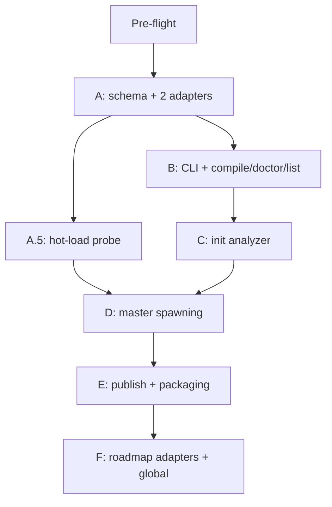

# Murmuration — Detailed Implementation Report

**Date:** 2026-06-14
**Topic:** Tool-agnostic, packageable multi-agent + subagent framework (`murmur` bun CLI)
**Source plan:** [`_architect/analysis/2026-06-14-murmur-multi-agent-framework.md`](../analysis/2026-06-14-murmur-multi-agent-framework.md) (final, 47/55)
**Phased plan:** [`_architect/implementations/2026-06-14-murmur-phases.md`](2026-06-14-murmur-phases.md)
**Test plan:** [`_architect/tests/2026-06-14-murmur-test-plan.md`](../tests/2026-06-14-murmur-test-plan.md)
**Target repo:** `/Users/cnickson/projects/murmur`
**Target stack:** bun >=1.0, TypeScript ^5.7, ESM
**Status:** v0.1.0 shipped; successor plan: orchestration layer (v0.2+)

---

## 1. Implementation Overview

This report translates the finalized Murmuration strategic plan into a granular, file-by-file build guide for the `murmur` bun CLI. The product being built is a tool-agnostic multi-agent framework that authors agents, subagents, skills, and instructions once in a neutral intermediate representation (the `murmur/` directory) and compiles them to multiple runtimes through a pluggable adapter architecture. The framework's reason to exist is knowledge externalization: generic agent bodies must carry zero codebase-specific facts, with all domain knowledge pushed into skills and instructions. The v0.1.0 scope is the deterministic structural auto-init, compile-once/emit-many across two structurally dissimilar runtimes (Copilot persona-Markdown and goose parameterized-recipe), a CI-enforced externalization gate, master-agent dynamic spawning, and a defense-in-depth publish scrubber.

The work touches a single repository at `/Users/cnickson/projects/murmur`, which currently contains only a scaffold: a [`package.json`](../../../murmur/package.json) declaring the `murmur` name and the `./dist/cli.js` bin entry with stub `build`/`dev`/`test` scripts, a `README.md`, a `docs/VISION.md`, a `.gitignore`, a `LICENSE`, and one git commit. Everything else — `src/`, `templates/`, `tests/`, `murmur.config.ts`, and the build pipeline — is greenfield and created by the phases below.

The build is organized into eight phases that strictly de-risk one another. **Pre-flight** is operational and security hardening (token revocation, `gh` re-auth, private remote). **Phase A** hand-authors the IR and proves the schema against the two adapters before freezing it. **Phase A.5** empirically probes runtime hot-load capability. **Phase B** builds the CLI skeleton and the `compile`/`doctor`/`list` commands. **Phase C** builds the `init` analyzer (structural pass then semantic pass). **Phase D** builds the master-agent spawning behavior. **Phase E** implements `publish`, the `add` scaffolders, and packaging. **Phase F** is the post-v0.1.0 roadmap (Claude Code, Cursor, ACP, global commands). The single most important discipline is to resist building the analyzer first: the schema and the two adapters must come first, or the project risks generating output for an abstraction that has never been validated.

The directories created under the repo root, in rough order of appearance, are: `murmur/` (the hand-authored IR with `agents/`, `subagents/`, `skills/`, `instructions/`, and `murmur.config.ts`), `src/` (the CLI implementation with `schema/`, `compiler/`, `compiler/adapters/`, `commands/`, `analyzer/`, `publish/`, `util/`, and `cli.ts`), `templates/` (scaffolding assets shipped with the package, including the base library of generic agents and the `subagent-authoring` skill), `tests/` (bun test suites and `fixtures/`), and `docs/` (extended with `COMPARISON.md` alongside the existing `VISION.md`).

## 2. Technology Stack Summary

**Runtime — bun >=1.0.** The CLI runs on bun, declared in `package.json` `engines.bun` as `>=1.0.0`. bun provides the test runner (`bun test`), the bundler (`bun build`), the package manager, and the TypeScript transpiler with no separate compile step for local execution. The plan mandates bun-native APIs where they reduce dependencies: `Bun.file`/`Bun.write` for file IO, `Bun.Glob` for glob matching in `doctor` and `applyTo` validation, and `bun:test` for the test suites. The CLI binary is bundled to `dist/cli.js` with a `#!/usr/bin/env bun` shebang, which causes bun's bundler to auto-select `target: "bun"`.

**Language — TypeScript ^5.7, ESM.** The repo's `package.json` already sets `"type": "module"`, so all source is ESM with explicit `.js`-less import specifiers resolved by bun. TypeScript `^5.7` is the workspace baseline established by `calebjebadurai.com` and `agri`. A `tsconfig.json` must be created at the repo root with `moduleResolution: "bundler"`, `module: "esnext"`, `target: "esnext"`, `strict: true`, `verbatimModuleSyntax: true`, and `types: ["bun"]` (via `@types/bun`). Type-checking is a separate `typecheck` script (`tsc --noEmit`) following the agri convention of standard script names `build`/`dev`/`lint`/`test`/`typecheck`.

**Workspace conventions.** The existing-patterns research establishes that the workspace follows agri's bun-plus-turbo style: `private`/`version` fields, standard script names, `bunx` for binary invocation, conventional-commits tooling (`@commitlint`, `lefthook.yml`), and `scripts/` for shell helpers. `murmur` is a single-package CLI rather than a monorepo, so it does not need turbo, but it should mirror the script naming, the conventional-commits hooks, and the `_architect/` output-directory convention. `chat/build.py` is the existing precedent for a "compile markdown assets into an output artifact" step — Murmuration's compiler is the TypeScript analog of that pattern.

**Schema and validation tooling.** The typed schema is expressed as TypeScript interfaces plus a runtime validator. To keep the dependency footprint small and the tarball under ten megabytes, the validator should be a hand-written narrowing validator over parsed frontmatter rather than a heavy schema library; if a library is used it must be a small, tree-shakeable one (e.g. a Zod-style validator) declared as a runtime dependency and bundled. YAML frontmatter parsing requires a small YAML parser dependency (the only unavoidable third-party runtime dependency for the IR reader); it is bundled into `dist/cli.js`.

**Output format knowledge (grounding the adapters).** The Copilot adapter emits `.github/agents/<name>.agent.md`, `.github/instructions/<name>.instructions.md`, and skill files, matching the exact frontmatter fields catalogued in the existing-patterns research: `description` (a `"Use when: …"` string), `tools` (array, coarse aliases or fully-qualified IDs), `agents` (array of dispatchable subagent names), `model` (array of display names), `user-invocable` (boolean), and `disable-model-invocation` (boolean); identity is the filename, and `argument-hint` is never used. Instruction files carry only an `applyTo` glob in frontmatter. The goose adapter emits recipe YAML modeled on the goose recipe schema from the industry research: typed `parameters` (`string`/`number`/`boolean`/`date`/`file`/`select` with `required`/`optional`/`user_prompt` levels and Jinja `{{ }}` substitution), `extensions`/`available_tools`, `sub_recipes`, `settings` (model/`max_turns`), `retry`, and `response.json_schema`, plus AGENTS.md/CLAUDE.md parity files at the output root.

## 3. Phase-by-Phase Implementation

### Phase Pre-flight — Operational & Security Hardening

**Purpose.** Resolve the security and operational blockers before any code is written, so the build phases run against a clean, pushable repository. **Delivers:** a revoked leaked token, an authenticated `gh`, verified `.gitignore` coverage, and a private remote with the scaffold commit pushed. **Dependencies:** none; this is the first action.

**Prerequisites.** The murmur repo exists locally with one scaffold commit and no remote. The user's `.env` (in the personal workspace, not the murmur repo) was found this session to contain a live GitHub token.

**Step-by-step breakdown.**

- **Revoke the exposed token.** *What:* invalidate the GitHub token discovered in the user's `.env`. *Where:* GitHub account settings (Developer settings → tokens) — not a code change. *Why:* the token is live and was exposed in plaintext; rotation is mandatory before any push. *Watch out for:* the murmur build must never read or handle raw credentials — credential handling is delegated entirely to `gh`. *Verification:* the old token returns 401 against the GitHub API.
- **Re-authenticate `gh`.** *What:* run `gh auth login` through gh's own secure device flow. *Where:* terminal in the murmur repo. *Watch out for:* GitHub remote creation is blocked until `gh` auth succeeds; do not script around it with a raw token. *Verification:* `gh auth status` reports an authenticated account.
- **Confirm `.env` ignore coverage.** *What:* verify `.env` is git-ignored in every project (personal, agri, elec, murmur). *Where:* each repo's `.gitignore`. *Watch out for:* a tracked `.env` already in history needs history scrubbing, which is out of scope here but must be flagged. *Verification:* `git check-ignore .env` returns the path in each repo.
- **Create and push the private remote.** *What:* create a private `murmur` GitHub repo and push the scaffold commit. *Where:* `gh repo create murmur --private --source . --push`. *Verification:* the remote exists and `git log` on the remote shows the scaffold commit. *Note:* Phase A becomes the second commit, satisfying the two-commit hygiene criterion.

**Phase deliverables.** Rotated credentials, authenticated `gh`, a pushed private remote.

**Phase risks and mitigations.** *Risk:* pushing before the token is revoked re-exposes it. *Mitigation:* strict ordering — revoke first, then push. *Risk:* the murmur process is tempted to handle credentials. *Mitigation:* never; all auth flows through `gh`.

### Phase A — Foundation and Schema Validation

**Purpose.** Establish the abstract intermediate representation and prove it survives contact with two genuinely different runtime paradigms before any command or analyzer is built. **Delivers:** the hand-authored `murmur/` IR, the typed schema with a runtime validator, the `RuntimeCompiler` interface, and the Copilot and goose adapters, all proven by golden-file tests. **The schema freezes at the end of this phase.** **Dependencies:** Pre-flight complete.

**Prerequisites.** A `tsconfig.json` at the repo root (see Technology Stack Summary), `@types/bun` and the YAML parser added as dependencies, and an empty `src/` tree.

#### Step A1 — Hand-author the minimal IR

*What to do:* author the smallest IR that exercises every schema feature, so the adapters are forced to handle the full surface immediately. *Where:* create `murmur/agents/`, `murmur/subagents/`, `murmur/skills/`, `murmur/instructions/`, and `murmur.config.ts` at the repo root. Author one master agent (`murmur/agents/master.md`), three generic agents drawn from the recurring ten-agent archetype (`murmur/agents/critic.md`, `murmur/agents/implementer.md`, `murmur/agents/researcher.md`), one subagent with spawn metadata (`murmur/subagents/example-specialist.md`), two flat skills (`murmur/skills/<name>/SKILL.md`), and one instruction with an `applyTo` glob (`murmur/instructions/<name>.md`). At least one agent must reference both a skill and an instruction so the adapters exercise reference resolution.

*How it connects:* this IR is the fixture input for every golden-file test and the seed of the shipped base library (`templates/`) in Phase E. *Technology-specific guidance:* each file is Markdown with a YAML frontmatter block delimited by `---` fences, exactly matching the existing-patterns `.agent.md` body structure (an `# Name — Role` H1, a bold persona sentence, a `## Core Mandate` list, procedure sections, and a `## Constraints` block) but with **zero project facts** in agent bodies. *Watch out for:* the temptation to copy a real domain agent — agent bodies here must be generic; any `/Users/` path, repo name, or domain term belongs in a skill. *Verification:* the knowledge-externalization scanner (built in Phase A's tests) reports zero project facts across `murmur/agents/`.

#### Step A2 — Define the typed schema

*What to do:* express the IR as TypeScript interfaces in `src/schema/`. Create `src/schema/agent.ts`, `src/schema/subagent.ts`, `src/schema/skill.ts`, `src/schema/instruction.ts`, `src/schema/config.ts`, and an `src/schema/index.ts` barrel. *The precise data shapes (in prose):*

- **`AgentDefinition`** carries: `name` (string, derived from filename), `description` (string, the `"Use when: …"` trigger), `role` (the prose body), `tools` (string array of neutral tool tags), `skills` (string array of referenced skill names), `instructions` (string array of referenced instruction names), `model` (optional string array of preferred-model hints), and `userInvocable` (optional boolean). Agent identity is the filename stem, mirroring the Copilot convention.
- **`SubagentDefinition`** extends `AgentDefinition` with `spawn` metadata: a `trigger` (when the master should consider spawning it), `attachSkills`/`attachInstructions` (what the `subagent-authoring` skill attaches), and `toolPolicy` (the restricted tool set). It is dispatch-only by default (`userInvocable: false`).
- **`SkillDefinition`** carries: `name`, `description`, `body` (the knowledge payload, where all codebase-specific content legitimately lives), and an optional `assets` field (permitted in the schema but restricted to single-file `SKILL.md` in v0.1.0 per the open-question resolution).
- **`InstructionDefinition`** carries: `applyTo` (a glob string) and `rules` (the body). No `description`, `tools`, or `name` — matching the minimal observed instruction frontmatter.
- **`MurmurConfig`** carries: `targets` (enabled compile-target identifiers), `project` (name/metadata), `plugins` (adapter registration), and `publish` (scrub rules: `denylist`, `domainTerms`, `placeholders`, `allowlist`).

*How it connects:* every adapter, command, and the analyzer consume these types. *Watch out for:* over-engineering — do not add fields a runtime never consumes; the schema must be the union of what Copilot and goose actually need, nothing speculative. *Verification:* `tsc --noEmit` passes and the interfaces compile.

#### Step A3 — Build the runtime validator

*What to do:* implement a runtime validator in `src/schema/validate.ts` that parses a frontmatter+body Markdown file, narrows it to the typed shape, and returns a discriminated result (`{ ok: true, value }` or `{ ok: false, errors: [{ message, file, field }] }`). *How it connects:* `doctor` (Phase B) and every command that reads the IR call this. *Technology-specific guidance:* use the bundled YAML parser for frontmatter and `Bun.Glob` validity checks for `applyTo`. *Watch out for:* error messages must include the file path and field so `doctor` can surface them precisely. *Verification:* feeding the Phase A IR returns `ok: true` for all files; feeding a malformed fixture returns structured errors.

#### Step A4 — Define the RuntimeCompiler interface

*What to do:* define the adapter contract in `src/compiler/RuntimeCompiler.ts`. *The interface (in prose):* a `RuntimeCompiler` exposes `id` (the target identifier, e.g. `"copilot"`, `"goose"`); `compileAgent(agent, ctx)`, `compileSkill(skill, ctx)`, and `compileInstruction(instruction, ctx)` methods that each return one or more `EmittedFile` objects (a relative output path plus contents); a `resolveAssets(skill, ctx)` strategy for copy-alongside asset handling; and an optional `finalize(ctx)` hook that emits target-level files (e.g. goose's AGENTS.md/CLAUDE.md). The `ctx` carries the resolved `MurmurConfig`, the full IR set (so an adapter can resolve cross-references), and the staging directory path. *How it connects:* the compiler registry (Phase B) iterates registered adapters; adding a runtime is implementing this one interface. *Watch out for:* graceful degradation must be expressible — on a runtime lacking subagents, `compileAgent` for the master can flatten subagent logic inline rather than failing. *Verification:* the interface compiles and both adapters implement it without `any` casts.

#### Step A5 — Implement atomic staging-then-move

*What to do:* implement the compile driver in `src/compiler/compile.ts` that, per target, assembles every `EmittedFile` into a temporary staging directory and moves the tree into place only after the full target compiles successfully. *Where:* `src/compiler/compile.ts` plus a `src/util/atomicMove.ts` helper. *How it connects:* both adapters and the `compile` command rely on this so a mid-compile failure never leaves a half-written `.github/agents/` tree. *Technology-specific guidance:* stage under a sibling temp dir on the same filesystem (so the move is atomic via `rename`), then swap. *Watch out for:* cross-filesystem moves are not atomic — keep staging on the same volume as the output. *Verification:* the atomicity test (test plan, Compiler correctness) deliberately throws inside an adapter mid-compile and asserts the target tree is untouched.

#### Step A6 — Implement the Copilot adapter

*What to do:* implement `src/compiler/adapters/copilot.ts`. *Output:* `compileAgent` emits `.github/agents/<name>.agent.md` with frontmatter carrying exactly the fields from the existing-patterns research — `description` (the `"Use when: …"` string), `tools` (mapped from neutral tags to coarse aliases by default), `agents` (the dispatchable roster, from subagent references), `model` (if present), `user-invocable`, and `disable-model-invocation` — over the prose body; identity is the filename, and `argument-hint` is never emitted. `compileInstruction` emits `.github/instructions/<name>.instructions.md` with only an `applyTo` glob in frontmatter and the rules as the body. `compileSkill` emits the skill into the location Copilot discovers (a `SKILL.md` with `name`+`description` frontmatter). *How it connects:* this is one of the two validation targets. *Watch out for:* the two tool notations (coarse aliases vs fully-qualified IDs) — v0.1.0 emits coarse aliases by default; preserve fully-qualified IDs only when explicitly tagged. *Verification:* golden-file test byte-compares (or schema-validates) the output against `tests/fixtures/copilot/`.

#### Step A7 — Implement the goose adapter

*What to do:* implement `src/compiler/adapters/goose.ts`. *Output:* `compileAgent`/`compileSubagent` emit recipe YAML modeled on the goose recipe schema: typed `parameters` (with `required`/`optional`/`user_prompt` levels and Jinja `{{ }}` substitution into `instructions`/`prompt`), declared `extensions` plus an `available_tools` allow-list mapped from the agent's `tools`, `sub_recipes` mapped from subagent references (with sequential/parallel hints), `settings` (model and `max_turns`), and `response.json_schema` for structured-output agents. `finalize` emits AGENTS.md and a mirrored CLAUDE.md at the output root. `compileSkill`/`compileInstruction` map to goose's skill/hint locations. *How it connects:* this is the structurally dissimilar target that genuinely validates the IR — if the IR compiles cleanly to both persona-Markdown and the recipe paradigm, the abstraction is proven rather than a field-rename. *Watch out for:* goose's parameter model is the place where a too-Copilot-shaped IR breaks; if an agent cannot be expressed as a parameterized recipe, the schema needs adjusting *now*, before it freezes. *Verification:* golden-file test against `tests/fixtures/goose/`.

#### Step A8 — Prove round-trip and freeze the schema

*What to do:* write `tests/compiler.test.ts` that compiles the Phase A IR to both targets and validates the output against the fixtures, plus the atomicity test. *How it connects:* passing both golden-file suites is the gate that freezes the schema. *Watch out for:* from this point, any schema change is a breaking change requiring a version bump and adapter review. *Verification:* `bun test tests/compiler.test.ts` passes for both targets and the atomicity assertion holds (test plan, Compiler correctness, Criterion 2).

**Phase A deliverables.** A frozen typed schema, a runtime validator, the `RuntimeCompiler` interface, atomic staging, the Copilot and goose adapters, golden fixtures, and passing compiler tests.

**Phase A risks and mitigations.** *Risk:* schema over-engineering. *Mitigation:* the two-dissimilar-adapter validation-first sequence — the schema only freezes after both adapters pass. *Risk:* the goose recipe paradigm exposes a missing field after the schema is assumed stable. *Mitigation:* do not write any command until A8 passes; treat A as a hard gate.

### Phase A.5 — Runtime Capability Probe

**Purpose.** Empirically determine, per target runtime, whether an agent can write a new subagent definition mid-session and dispatch it within the same session — i.e. whether the runtime hot-loads dynamically written agent files. This is currently unverified for Copilot and Claude and must be measured, not assumed. **Delivers:** a recorded, per-runtime hot-load result that gates the Phase D spawn-path selection. **Dependencies:** Phase A complete (the IR and adapters exist, so a real subagent file can be produced for the probe).

**Prerequisites.** At least the Copilot runtime available to test against; the goose runtime if accessible.

#### Step A5.1 — Design the probe methodology

*What to do:* write a one-page reproducible probe procedure and record it at `_architect/tests/` or `docs/probes/hot-load.md`. *The methodology (in prose):* within a single host-runtime session, (1) have the agent write a new, uniquely-named subagent definition to the runtime's discovery location (e.g. `.github/agents/probe-<uuid>.agent.md` for Copilot), (2) immediately attempt to dispatch it by name via the runtime's subagent mechanism (`agent/runSubagent` for Copilot), (3) record whether the dispatch resolves the just-written agent or fails to find it, and (4) repeat three times to rule out timing flakiness. *How it connects:* a positive result selects the file-writing spawn path in Phase D; a negative result selects the in-context ephemeral-persona path. *Watch out for:* a runtime may cache its agent registry at session start — distinguish "not hot-loaded" from "needs a manual refresh," and record which. *Verification:* the procedure is reproducible and yields a deterministic yes/no per runtime.

#### Step A5.2 — Execute and record per-runtime results

*What to do:* run the probe against Copilot (mandatory) and goose (if available), and record the result in a checked-in table. *Where:* `docs/probes/hot-load.md` with a row per runtime (runtime, hot-load yes/no, refresh-required, notes, date). *How it connects:* this table is the authoritative input to Phase D's path selection and gates Criterion 3. *Watch out for:* no phase that depends on spawning may proceed on an unproven hot-load assumption — if a runtime is untested, Phase D must treat it as no-hot-load and use the ephemeral path. *Verification:* the table has a definitive entry for every runtime Phase D will demonstrate spawning on.

**Phase A.5 deliverables.** A documented probe methodology and a recorded per-runtime hot-load result.

**Phase A.5 risks and mitigations.** *Risk:* assuming hot-load works and silently breaking spawning. *Mitigation:* the probe is a hard gate before Phase D; absent a positive result, the ephemeral-persona path is used.

### Phase B — CLI Skeleton and Core Commands

**Purpose.** Build the bun-bundled CLI entry point and the commands that make a hand-written `murmur/` directory usable: `compile`, `doctor`, and `list`. **Delivers:** a runnable `murmur` binary wired to the Phase A compiler. **Dependencies:** Phase A (the compiler and validator).

**Prerequisites.** The frozen schema, the validator, and both adapters from Phase A.

#### Step B1 — Build the CLI entry point and router

*What to do:* implement `src/cli.ts` as the bin entry. *Where:* `src/cli.ts` (bundled to `dist/cli.js`). *The command surface (in prose):* the dispatcher routes the first positional argument to a command module — `init`, `add`, `compile`, `doctor`, `publish`, `list`, `update` — and handles `--help` globally and per-command. *Behavior:* no arguments prints a friendly usage summary with command suggestions (not an error stack); an unknown command prints a suggestion. *How it connects:* every command module registers here. *Technology-specific guidance:* keep the router dependency-free (parse `Bun.argv` directly or use a tiny arg parser bundled into `dist`); the shebang `#!/usr/bin/env bun` must be the first line so bun's bundler selects `target: "bun"`. *Watch out for:* commands that need a `murmur/` directory must print a clear "run `murmur init` first" error when it is absent. *Verification:* `murmur --help` shows usage; no-arg shows the friendly summary; every command responds to `--help` (test plan, CLI usability, Criterion 6).

#### Step B2 — Implement `compile`

*What to do:* implement `src/commands/compile.ts`. *The command surface:* `murmur compile [--target <id>] [--out <dir>] [--allow-config-exec]`; with no `--target` it compiles every target listed in `murmur.config.ts`. *What it does:* loads the config via the constrained loader (Section 7), reads and validates the `murmur/` IR, and invokes the compile driver (Step A5) for each requested target. *How it connects:* this is the user-facing wiring of the Phase A compiler. *Watch out for:* a missing `murmur/` directory triggers the "run `murmur init` first" message; an invalid target id lists available targets. *Verification:* compiling the Phase A IR produces the same output the golden-file tests assert; a file-modifying run prints a change summary.

#### Step B3 — Implement `doctor`

*What to do:* implement `src/commands/doctor.ts`. *What it validates:* schema correctness (via the validator), reference integrity (every `skills`/`instructions`/subagent reference resolves to an existing definition), `applyTo` glob syntax (via `Bun.Glob`), and circular-subagent-dependency detection. *The command surface:* `murmur doctor`, exit 0 on success, non-zero with per-error description and file path on failure. *How it connects:* `compile` and `publish` should refuse to run if `doctor` would fail. *Watch out for:* error output must be bidirectional-test-friendly — each error names the file and the field. *Verification:* a freshly initialized project reports zero errors and exit 0; a deliberately corrupted fixture (missing referenced skill, malformed YAML, invalid `applyTo`, circular subagent) reports each error with a clear description and path and a non-zero exit (test plan, Doctor, Criterion 8).

#### Step B4 — Implement `list`

*What to do:* implement `src/commands/list.ts` to enumerate the IR definitions (agents, subagents, skills, instructions) found in `murmur/`, and, as the minimal global surface, list globally installed murmur packs. *How it connects:* gives users an inventory view before compiling. *Watch out for:* running without a `murmur/` directory still works for the global-pack listing but notes the absence of a project. *Verification:* `list` prints the Phase A IR inventory.

**Phase B deliverables.** A runnable `murmur` CLI with `compile`, `doctor`, and `list`, plus global `--help`/no-arg behavior.

**Phase B risks and mitigations.** *Risk:* CLI grows ad-hoc argument handling. *Mitigation:* a single router with a uniform command-module contract. *Risk:* `compile` runs on invalid IR. *Mitigation:* gate `compile`/`publish` behind a `doctor` pass.

### Phase C — The init Analyzer

**Purpose.** Generate the `murmur/` directory for any codebase in two passes: a deterministic structural pass that needs no LLM, and an optional semantic pass that runs inside the user's host agent. **Delivers:** `murmur init` with structural generation, merge/overwrite/cancel handling, and the `murmur-init` agent/skill for semantic enrichment. **Dependencies:** Phases A and B (the schema and the `add`/write machinery).

**Prerequisites.** The frozen schema and the CLI router. A representative Node/TypeScript fixture project under `tests/fixtures/sample-project/` to validate against.

#### Step C1 — Implement the deterministic structural pass

*What to do:* implement `src/analyzer/structural.ts` and wire it behind `src/commands/init.ts`. *What it parses (pure bun static analysis, no LLM, no network):* `package.json` (name, scripts, dependencies, `type`), `tsconfig.json` (compiler options, paths), the directory tree (top-level layout, `src`/`apps`/`packages` shape), lockfiles (`bun.lockb`/`package-lock.json`/`pnpm-lock.yaml` → package manager), test configuration (`bun:test`, vitest/jest config presence), and CI workflow files (`.github/workflows/*`). *What it emits:* neutral structural **skills** — `murmur/skills/project-structure/SKILL.md` (the directory layout and module map), `murmur/skills/build-system/SKILL.md` (package manager, scripts, bundler), `murmur/skills/test-conventions/SKILL.md` (test runner and layout) — and `applyTo`-scoped **instructions** for language conventions (e.g. `murmur/instructions/typescript-conventions.md` scoped to `**/*.ts`). It also lays down the generic agent base library and the master agent copied from `templates/`. *How it connects:* this is the v0.1.0 acceptance bar; the semantic pass is enrichment on top. *Technology-specific guidance:* use `Bun.file`/`Bun.Glob`; the "no separate API key" claim is literally true here because no LLM is involved. *Watch out for:* the structural pass must stay under the two-minute budget on a moderate project — keep parsing shallow and avoid walking `node_modules`. *Verification:* run against `tests/fixtures/sample-project/` and assert it produces the generic agents, the three structural skills, and the scoped instructions in under two minutes (test plan, Init analyzer, Criterion 1).

#### Step C2 — Handle merge/overwrite/cancel on re-run

*What to do:* implement idempotent re-run handling in `src/commands/init.ts`. *Behavior:* when `murmur/` already exists, prompt with merge (add only missing files), overwrite (replace, with confirmation), or cancel; `init` must never overwrite without confirmation. *How it connects:* satisfies the file-safety constraint. *Watch out for:* default to the safest branch (cancel) on a non-interactive invocation. *Verification:* re-running `init` on an initialized fixture exercises each branch and never silently clobbers (test plan, Init analyzer).

#### Step C3 — Ship the agent-invoked semantic pass

*What to do:* author the `murmur-init` agent/skill in `templates/` (`templates/agents/murmur-init.md` plus `templates/skills/codebase-init/SKILL.md`) that the user runs from inside their own host agent (Copilot, Claude, or goose). *The control flow (corrected dependency direction):* the host agent's LLM is the caller; it invokes the CLI's structural pass (the callee) for the deterministic facts, then authors the semantic skills (architecture rationale, domain glossary, non-obvious conventions) using the IDE LLM it already has — incurring no separate credential. *How it connects:* this is the recommended semantic model because it matches the real CLI-to-LLM dependency arrow. *Watch out for:* the deterministic CLI must never assume it can summon the IDE LLM; the agent calls the CLI, never the reverse. *Verification:* the `murmur-init` agent, run in a host agent, produces semantic skills that pass `doctor`; validated separately and not held to the two-minute budget.

#### Step C4 — Ship the headless-CLI semantic fallback

*What to do:* implement `src/analyzer/semantic.ts` with an optional `murmur init --semantic` path that, when an installed and authenticated headless agent binary (`claude` or `goose`) is present, shells out to it with a generated prompt and ingests the result. *How it connects:* a fallback for users without an interactive host agent. *Watch out for:* it is per-runtime, network-dependent, and consumes the user's own subscription — offer it as a fallback, never the default; sample representative files and chunk to respect context limits on large codebases. *Verification:* with a stub binary, `--semantic` shells out, ingests, and writes semantic skills; absent the binary, it degrades cleanly to structural-only with a clear message.

**Phase C deliverables.** `murmur init` with the structural pass, merge/overwrite/cancel handling, the `murmur-init` agent/skill, and the headless fallback.

**Phase C risks and mitigations.** *Risk:* assuming the CLI can call the IDE LLM (unbuildable). *Mitigation:* the structural/semantic split with the agent-invoked model. *Risk:* semantic non-determinism and token limits. *Mitigation:* scope v0.1.0's acceptance bar to the structural pass; treat semantic as optional, sampling/chunking enrichment.

### Phase D — Master Agent Spawning

**Purpose.** Implement the master agent's dynamic subagent spawning as an in-runtime behavior encoded in the shipped `subagent-authoring` skill plus the generic master-agent body — the deterministic `bun` process is not involved in any spawn at runtime. **Delivers:** the `subagent-authoring` skill, the match-or-spawn loop with both invocation paths, and two demonstrated spawn scenarios. **Dependencies:** Phase A.5 (the hot-load result selects the path) and the base library from Phase A/C.

**Prerequisites.** A recorded hot-load result for at least one runtime, and the generic master agent in `templates/agents/master.md`.

#### Step D1 — Author the `subagent-authoring` skill

*What to do:* author `templates/skills/subagent-authoring/SKILL.md`. *What it encodes (externalizing the spawn heuristic, consistent with the framework principle that knowledge lives in skills):* the rules for which skills to attach to a spawned specialist, which instructions are relevant, what tools to allow (the restricted `toolPolicy`), and how to phrase a focused role description. *How it connects:* the master agent loads this skill rather than hardcoding or freely improvising spawn logic, keeping the master itself generic. *Watch out for:* the skill must contain no project facts — it is procedural, not domain knowledge. *Verification:* `doctor` validates the skill; the spawn scenarios (D3) produce well-formed subagents by following it.

#### Step D2 — Implement the match-or-spawn loop with both paths

*What to do:* encode the master agent's loop in `templates/agents/master.md`. *The loop (in prose):* decompose a task, consult the registry of available subagents, and match each subtask to a specialist; when none fits, load `subagent-authoring`, draft a scoped subagent definition (attaching the skills/instructions the skill's rules indicate, restricting tools, writing a focused role description), and invoke it. *The two invocation paths, selected by the Phase A.5 probe result:* when the runtime hot-loads, write the definition to a temporary location and dispatch it by name; when it does not, compose an in-context ephemeral persona — an inline role description with the relevant skills/instructions passed directly in the subagent prompt — rather than writing a file the runtime cannot rediscover. *The persist decision (applies in either path):* persist to `murmur/subagents/` only when the same specialist is needed more than twice in a session. *How it connects:* keeps the master free of project knowledge while giving it a principled, externally-defined spawning procedure that works regardless of the runtime's discovery lifecycle. *Watch out for:* never use the file-writing path on a runtime whose probe result is negative or untested. *Verification:* the two scenario tests below.

#### Step D3 — Demonstrate the two spawn scenarios

*What to do:* demonstrate a data-validator spawn and a config-migrator spawn end-to-end on at least one runtime whose probe result is known. *Where:* scenario fixtures under `tests/fixtures/spawn/`. *How it connects:* these are the executable assertions for Criterion 3. *Watch out for:* the assertion is that a valid, readable subagent is produced and invoked via whichever path the probe selected — not that the agent's task output is correct (in-runtime functional execution is out of scope for v0.1.0). *Verification:* both scenarios assert a valid, readable subagent is produced and invoked via the selected path (test plan, Master-agent spawning, Criterion 3).

**Phase D deliverables.** The `subagent-authoring` skill, the master-agent match-or-spawn loop with file-writing and ephemeral-persona paths, and two passing spawn scenarios.

**Phase D risks and mitigations.** *Risk:* spawning silently breaks on a non-hot-loading runtime. *Mitigation:* path selection is gated on the A.5 probe; the ephemeral path is the safe default. *Risk:* the master accretes project knowledge. *Mitigation:* all spawn logic lives in the `subagent-authoring` skill, not the master body.

### Phase E — Publish and Packaging

**Purpose.** Implement the defense-in-depth `publish` scrubber, the `add` scaffolders, and finalize distribution. **Delivers:** `publish` with `--dry-run`/`--strict`/`--allow-config-exec`, `add agent|subagent|skill|instruction`, a bundled `dist/cli.js`, a sub-ten-megabyte tarball, `CHANGELOG.md`, `docs/COMPARISON.md`, and CI. **Dependencies:** Phases A–D (a complete IR and command set to publish and package).

**Prerequisites.** A passing `doctor`, the full command surface, and a pushed remote from Pre-flight.

#### Step E1 — Implement the `add` scaffolders

*What to do:* implement `src/commands/add.ts` dispatching to `add agent`, `add subagent`, `add skill`, and `add instruction`. *What each does:* copies the matching template from `templates/` into the right `murmur/` subdirectory with token substitution (name, description placeholders). *How it connects:* gives users a guided way to extend a hand-written IR. *Watch out for:* never overwrite an existing definition without confirmation. *Verification:* each scaffolder produces a `doctor`-valid definition.

#### Step E2 — Implement the publish scrubber

*What to do:* implement `src/publish/scrub.ts` and `src/commands/publish.ts`. *What it does:* reads `murmur/` and writes a scrubbed copy to a **separate** output directory (never mutating the source), replacing the detected repository name with a placeholder, stripping user-specific path prefixes (e.g. `/Users/<name>/`), redacting configured `domainTerms`, and masking email/name PII. *Crucially*, redaction is not limited to the user-maintained denylist: the scrubber additionally runs entropy-based and pattern-based secret scanning using gitleaks-style rulesets to catch high-entropy blobs, JWTs, and known token formats no configured list would name. *The command surface:* `murmur publish [--out <dir>] [--dry-run] [--strict] [--allow-config-exec]`. *How it connects:* this is a first-class safety layer, motivated by the live token leak this session exposed. *Watch out for:* documentation and CLI output must state that publish is defense-in-depth and the user owns final verification — never claim completeness. *Verification:* the sentinel-value fixture test below.

#### Step E3 — Implement `--dry-run` and `--strict` semantics

*What to do:* give the flags a single coherent meaning. *`--dry-run`:* shows the scrub diff without writing anything (mutates nothing). *`--strict`:* the publish **fails** if any high-entropy string or known-secret-pattern match survives anywhere in the output, with an explicit allowlist override (`publish.allowlist` in config) for strings the user has confirmed generic. *How it connects:* resolves the earlier "error on the unrecognized" self-contradiction into a precise failure condition. *Watch out for:* `--strict` keys off the entropy/pattern scanner, not the denylist, so it catches unlisted secrets. *Verification:* the false-negative test below.

#### Step E4 — Test the scrubber (including false-negative and security)

*What to do:* write `tests/publish.test.ts`. *Sentinel test:* a fixture with repo name `test-project`, domain term `proprietary-feature`, and a fake email; assert the output contains the placeholders, none of the originals, the source directory is untouched, `doctor` passes on the scrubbed output, and `--dry-run` mutates nothing. *False-negative test:* the fixture also embeds a high-entropy secret-shaped string in no configured denylist; assert `--strict` flags or fails on it via the entropy/pattern scanner — proving the scrubber does not silently pass unknown secrets. *Security test:* loading a `murmur.config.ts` containing executable code does not run that code unless `--allow-config-exec` is passed. *Verification:* all three assertions pass (test plan, Publish scrubber, Criterion 5).

#### Step E5 — Implement the constrained config loader

*What to do:* implement `src/util/loadConfig.ts`. *Behavior:* because `murmur.config.ts` is executable TypeScript, importing it runs arbitrary code, so the loader defaults to the JSON form (`murmur.config.json`) for untrusted contexts and requires an explicit `--allow-config-exec` flag before executing the TypeScript form. *How it connects:* `compile`, `publish`, and `doctor` all load config through this. *Watch out for:* never auto-execute a `.ts` config from an untrusted repository. *Verification:* the security test in E4.

#### Step E6 — Finalize packaging

*What to do:* replace the stub `build` script with the real bun build and set the packaging fields. *Where:* `package.json` and a `scripts/` helper if needed. *What:* `build` runs `bun build src/cli.ts --target bun --outdir dist` producing `dist/cli.js` with the `#!/usr/bin/env bun` shebang preserved (banner or source-first-line); the `bin` field already points to `./dist/cli.js`; the `files` field already lists `dist`, `templates`, `README.md`, `LICENSE` — confirm `templates/` ships the base library, the `subagent-authoring` and `murmur-init` skills, and the scaffolder templates. Bump `version` from `0.0.0` to `0.1.0`. *How it connects:* produces the distributable artifact. *Watch out for:* keep heavy/optional deps external if it shrinks the tarball, but ensure the YAML parser and validator are bundled so `bunx murmur` works zero-install. *Verification:* `bun pack` produces a tarball containing only intended files, under ten megabytes; installing it into a scratch directory and smoke-testing every command's `--help` succeeds (test plan, Packaging, Criterion 9).

#### Step E7 — Authoring docs and CI

*What to do:* write `CHANGELOG.md` (v0.1.0 entry) and `docs/COMPARISON.md` last, once the implemented feature set is known. *`docs/COMPARISON.md`:* state the two-tier differentiator — the shipped v0.1.0 union (deterministic structural auto-init, compile across two structurally-different paradigms, CI-enforced externalization, defense-in-depth publish) kept distinct from the aspirational v1.0 union (ACP, cross-runtime spawnable specialists, semantic init) — and label the ECC.tools/Hermes analysis as based on public materials only. *CI:* add a workflow that runs `bun test`, `typecheck`, and the knowledge-externalization scanner as a release-blocking gate. *How it connects:* the externalization scanner is the framework's hard CI gate. *Watch out for:* COMPARISON must describe what Murmuration actually does, not what it aspired to. *Verification:* CI runs on the pushed remote and the externalization scanner passes (Criterion 4).

**Phase E deliverables.** `publish` with all flags, the `add` scaffolders, the constrained config loader, a bundled sub-10MB package, `CHANGELOG.md`, `docs/COMPARISON.md`, and CI with the externalization gate.

**Phase E risks and mitigations.** *Risk:* incomplete scrubbing leaks secrets. *Mitigation:* entropy/pattern scanning beyond the denylist, `--strict`, and explicit defense-in-depth disclaimers. *Risk:* config-exec code execution. *Mitigation:* the constrained loader and `--allow-config-exec` gate. *Risk:* tarball bloat. *Mitigation:* `files` scoping and `bun pack` size assertion.

### Phase F (roadmap) — Additional Runtimes and Global Commands

**Purpose.** Post-v0.1.0 expansion. **Delivers:** Claude Code, Cursor, and ACP adapters; the deferred global-command surface; and deepened semantic-init analysis. **Dependencies:** a frozen, validated schema and stable adapter interface from v0.1.0.

**Step-by-step breakdown.** *Claude Code adapter* (`src/compiler/adapters/claude.ts`): a near-free third adapter since it shares Copilot's persona-Markdown substrate; valuable for the spawning demonstration but explicitly not a validation target. *Cursor adapter* (`src/compiler/adapters/cursor.ts`): emits `.cursor/rules` MDC and `.cursor/skills`. *ACP adapter* (`src/compiler/adapters/acp.ts`): the protocol-level portability target — emit an ACP-speaking agent process, reusing MCP JSON shapes for tool/extension declarations so they are simultaneously valid for MCP, Claude `mcpServers`, goose `extensions`, and ACP. *Global commands:* implement full global operations beyond the v0.1.0 minimal `list`. *Deepened semantic init:* fuller semantic extraction beyond the structural acceptance bar. *Watch out for:* each new adapter implements the same `RuntimeCompiler` interface and is independently versioned with its own golden-file tests to absorb runtime drift. *Verification:* per-adapter golden-file tests; these are all post-v0.1.0 and not release-blocking.

**Phase F deliverables.** Three additional adapters, global commands, and deeper semantic init — none gating v0.1.0.

**Phase F risks and mitigations.** *Risk:* runtime format drift breaks adapters silently. *Mitigation:* per-adapter golden-file tests and independent adapter versioning. *Risk:* ACP remote support is immature. *Mitigation:* ACP stays on the roadmap, not the v0.1.0 foundation.

## 4. Cross-Cutting Concerns

**Error handling.** Validation is the system's boundary: the `validate.ts` narrowing validator returns structured `{ message, file, field }` errors that `doctor` surfaces with exact file paths and `compile`/`publish` refuse to proceed on. Within the deterministic CLI, fail loudly with actionable messages (e.g. "run `murmur init` first", "unknown target `<x>`, available: …") rather than stack traces. Do not add speculative error handling for impossible states — validate at the IR read boundary and the config load boundary, and trust the typed shapes thereafter.

**Logging and monitoring.** The framework collects zero telemetry (a hard non-goal). File-modifying commands print a human-readable change summary (files written, moved, skipped). `--dry-run` on `publish` is the primary observability surface for the scrubber, showing a diff without side effects. Verbose output is opt-in via a `--verbose` flag, off by default.

**Security.** Three vectors are addressed structurally: (1) config code-execution is gated by the constrained loader and `--allow-config-exec`; (2) secret leakage on publish is mitigated by entropy/pattern scanning beyond the denylist plus `--strict`; (3) credentials are never handled by murmur — all GitHub auth flows through `gh`. Publish never mutates the source and always writes to a separate directory. The framework owns no network calls on the deterministic path (structural init, compile, doctor, publish all run offline).

**Performance.** The deterministic structural init pass must complete under two minutes on a moderate Node/TypeScript project — keep parsing shallow, never walk `node_modules`, and use `Bun.Glob`. Compilation is atomic staging-then-move; staging stays on the same filesystem so the final move is an O(1) rename. The bundled CLI cold-starts via `dist/cli.js` with the bun runtime; an optional `--bytecode`/`--compile` single-file build is a packaging option for faster cold start.

**Accessibility.** As a CLI, accessibility means terminal-friendly output: no reliance on color alone (pair color with symbols/text), clear `--help` for every command, plain-text diffs, and machine-readable exit codes (0 success, non-zero failure) so the tool composes in scripts and CI for users with assistive tooling.

## 5. Migration and Data Considerations

There is no destructive data migration: Murmuration explicitly does not auto-migrate the user's existing seventy-one agents (a stated non-goal). The only stateful concerns are (1) the **schema freeze** at the end of Phase A — after which any schema change is a breaking change requiring a version bump and an adapter review across all golden fixtures; (2) **re-running `init`**, which is handled by the merge/overwrite/cancel branch (Step C2) and never overwrites without confirmation; and (3) **publish output**, which is always a fresh separate directory, leaving `murmur/` untouched. Golden fixtures under `tests/fixtures/` are versioned with the schema; when the schema legitimately changes post-freeze, fixtures are regenerated as part of the breaking-change review, not silently.

## 6. Integration Points

The principal integration boundary is the **`RuntimeCompiler` adapter interface** (Step A4): every runtime integration is an implementation of `compileAgent`/`compileSkill`/`compileInstruction` + `resolveAssets` + `finalize`, consuming the shared IR and config via `ctx`. The second boundary is the **host-agent-to-CLI dependency direction** (Phase C): the host agent's LLM is always the caller and the deterministic CLI is the callee — the arrow never reverses, which is why the structural pass needs no API key and the semantic pass is agent-invoked. The third set of boundaries is the **runtime output contracts**: the Copilot adapter's `.github/agents/*.agent.md` / `.github/instructions/*.instructions.md` files with their exact frontmatter fields; the goose adapter's recipe YAML (typed parameters, `sub_recipes`, `extensions`/`available_tools`, `response.json_schema`) plus AGENTS.md/CLAUDE.md parity; and, on the roadmap, the ACP JSON-RPC-over-stdio process reusing MCP JSON shapes. The fourth boundary is the **headless-CLI shell-out** (Step C4) to `claude`/`goose` binaries — feasible but per-runtime and network-dependent, hence a fallback.

## 7. Configuration and Environment

`murmur.config.ts` (with a `murmur.config.json` fallback) declares: `targets` (enabled compile-target identifiers), `project` (name and metadata), `plugins` (adapter registration — v0.1.0 registers TypeScript adapter files directly, deferring npm-package auto-discovery), and `publish` (the scrub rules: `denylist`, `domainTerms`, `placeholders`, `allowlist`). Because the `.ts` form is executable, the **constrained config loader** (Step E5) defaults to the JSON form for untrusted contexts and requires `--allow-config-exec` to execute the TypeScript form. Environment assumptions: bun >=1.0 on `PATH`, optional `claude`/`goose` binaries for the semantic fallback, and `gh` for remote operations. CI configuration (Step E7) runs `bun test`, `typecheck`, and the knowledge-externalization scanner as a release gate. No environment variables carry secrets; the framework reads none.

## 8. Implementation Order and Dependencies

The phase order is strict because each phase de-risks the next, and the single most important discipline is to **not build the analyzer first** despite its appeal. Hard dependencies: Pre-flight → A (clean repo before code) ; A → A.5 (need a real subagent file to probe) ; A → B (compiler before the `compile` command) ; A.5 + A/C base library → D (probe result selects the spawn path) ; A–D → E (full IR and commands before packaging). Parallelizable once Phase A's schema is frozen: the Copilot and goose adapters could in principle be written concurrently, but the plan recommends goose second precisely to stress the frozen schema; within Phase B, `compile`/`doctor`/`list` are independent and can be built in parallel; within Phase E, the `add` scaffolders and the publish scrubber are independent. The semantic passes (C3/C4) are independent of Phase D. Phase F is entirely post-v0.1.0 and parallelizable per adapter.

## 9. Completion Criteria

**Per phase:** Pre-flight — token revoked, `gh` authenticated, private remote pushed. A — both adapters pass golden-file tests and the atomicity test; schema frozen. A.5 — a recorded hot-load result for every runtime Phase D demonstrates on. B — `murmur --help`, no-arg friendly behavior, and `compile`/`doctor`/`list` working; `doctor` bidirectional tests pass. C — structural pass produces generic agents + structural skills + scoped instructions under two minutes on the fixture, with merge/overwrite/cancel exercised. D — two spawn scenarios produce valid, invoked subagents via the probe-selected path. E — publish sentinel + false-negative + security tests pass; `bun pack` under 10MB with all `--help` smoke tests; CHANGELOG and COMPARISON written; CI green.

**Overall v0.1.0 — the conjunction of the ten success criteria, with three non-negotiable release gates:** (1) the knowledge-externalization scanner reports zero project facts in `murmur/agents/` (and ≥80% of project terms in skills/instructions); (2) `doctor` passes on freshly initialized output; (3) the publish scrubber is proven against both sentinel values and an unlisted high-entropy secret with the source left untouched. Anything failing those three gates is not a release regardless of other progress.

## 10. Implementation Report Summary

Murmuration is built in eight phases that strictly de-risk one another, with the abstract-IR-plus-compiler architecture at its core. Pre-flight hardens security; Phase A hand-authors the `murmur/` IR and freezes the typed schema only after the Copilot (persona-Markdown) and goose (parameterized-recipe) adapters both pass golden-file tests through the `RuntimeCompiler` interface with atomic staging-then-move; Phase A.5 empirically probes runtime hot-load to gate the spawn path; Phase B delivers the bun-bundled CLI with `compile`/`doctor`/`list`; Phase C delivers the deterministic structural `init` pass plus the agent-invoked semantic pass; Phase D encodes dynamic spawning in the `subagent-authoring` skill and the master agent's match-or-spawn loop; Phase E ships the defense-in-depth publish scrubber, the `add` scaffolders, packaging, and CI; Phase F is the post-v0.1.0 roadmap. Every step is grounded in the bun/TypeScript/ESM stack and the existing-patterns conventions, maps to a specific file under `/Users/cnickson/projects/murmur`, and ties to a test-plan assertion. The three non-negotiable gates — zero project facts in agent bodies, `doctor` passing on fresh output, and a proven scrubber — define release.

## 11. Successor Work — Orchestration Layer (v0.2+)

**v0.1.0 shipped and is the foundation.** Everything in sections 1–10 above is built and released: the frozen four-kind IR (agents, subagents, skills, instructions), the `RuntimeCompiler` interface with atomic staging-then-move, the Copilot and goose adapters, the `compile`/`doctor`/`list`/`init`/`add`/`publish` commands, the knowledge-externalization gate, and the defense-in-depth scrubber. That compile-once/emit-many core is the load-bearing abstraction the successor work builds directly on top of — the orchestration layer adds new IR kinds and an optional driver *beside* this foundation without changing it, and the original twenty-five tests, golden files, and externalization scan remain a standing release gate for all successor milestones.

**The successor plan extends murmur from "compile agent definitions" to "compile — and optionally run — governed multi-agent pipelines."** A survey of the user's own projects found that the highest-value asset is not the agent definitions but the *orchestration* encoded by hand in `architect.agent.md`: a dual-branch (CODING / RESEARCH) pipeline with classification routing, per-phase selective-dispatch tables, hard loop-iteration caps, parallel-concurrency caps, multi-dimensional weighted scoring rubrics, output-section contracts, and RUN-LOG execution tracking — none of which the v0.1.0 IR can represent. The plan adds a fifth IR kind for **pipelines** (a branch-aware `PipelineDefinition` with routing, named branches each owning their phases/loops/parallel/tiers), a first-class **rubric** kind (with conditional dimensions and weighted multi-rubric aggregation), an instruction **`sections`** contract extension, and an optional, clearly-secondary **`murmur run`** driver. The durable moat is the *portable orchestration IR* — compile a governed pipeline once to a Copilot master agent and a goose recipe — fully realized by the compile path alone, with execution layered on as a convenience.

**The plan is honest about hard constraints the critic verified.** `murmur run`'s host-CLI subprocess execution is a **net-new code-execution surface with zero precedent in v0.1.0** — there is no subprocess spawning anywhere in `murmur/src` today, and `run` *inverts* the init dependency direction (init emits an artifact the host invokes; `run` makes murmur the active caller of a `claude`/`goose` CLI via `Bun.spawn`, gated behind `--allow-run`, targeting those two CLIs only since Copilot has no headless CLI). murmur deterministically owns only iteration-counting against caps, subprocess concurrency-capping, rubric *arithmetic* over host-supplied numbers, and RUN-LOG formatting; every dispatch, early-exit, and scoring *decision* stays generative and delegated to the host LLM. The work is staged across ten de-risking milestones (v0.2a IR → v0.2b compile/freeze → v0.2.0 goose-drivability spike → v0.2c deterministic `run` skeleton → v0.2d gated host-CLI delegation → v0.3 rubrics/contracts → adoption-gated v0.4–v0.7).

**This supersedes the "Phase F" framing above.** Section 3's *Phase F (roadmap) — Additional Runtimes and Global Commands* sketched the post-v0.1.0 future as "three more adapters plus global commands." That framing is now **outdated and superseded** by the dedicated successor roadmap: the additional adapters (Claude Code, Cursor, ACP) and the plugin model are relocated to the adoption-gated **v0.6**, and the pipeline/rubric/`run`/concurrency work that is the actual highest-value next step — absent from the original Phase F — is the committed **v0.2–v0.3** core. Treat the documents below, not Phase F, as the authoritative roadmap for what comes after v0.1.0.

**Successor documents (relative paths):**

- Strategic analysis & plan (final, 50/55): [`../analysis/2026-06-16-murmur-orchestration-layer.md`](../analysis/2026-06-16-murmur-orchestration-layer.md)
- Implementation phases extract: [`2026-06-16-murmur-orchestration-phases.md`](2026-06-16-murmur-orchestration-phases.md)
- Test plan: [`../tests/2026-06-16-murmur-orchestration-test-plan.md`](../tests/2026-06-16-murmur-orchestration-test-plan.md)
- Detailed implementation report: [`2026-06-16-murmur-orchestration-implementation.md`](2026-06-16-murmur-orchestration-implementation.md)
- Codebase extension-point analysis: [`../research/2026-06-16-murmur-orchestration-analysis.md`](../research/2026-06-16-murmur-orchestration-analysis.md)
