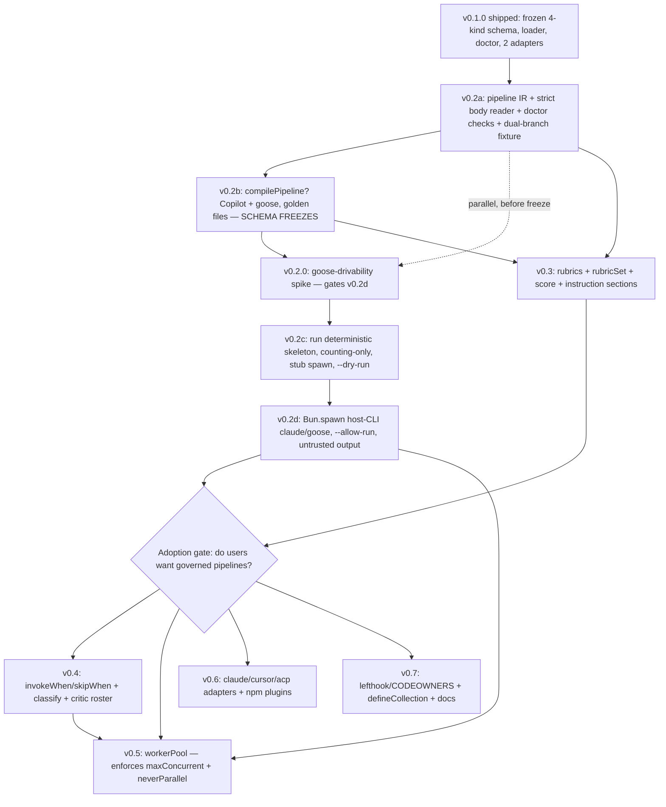

# Murmuration — Orchestration Layer Implementation Report (v0.2–v0.7)

**Date:** 2026-06-16
**Topic:** The orchestration layer — pipeline IR, scoring rubrics, dispatch tables, concurrency engine, `murmur run` — roadmap v0.2–v0.7
**Source plan:** [`../analysis/2026-06-16-murmur-orchestration-layer.md`](../analysis/2026-06-16-murmur-orchestration-layer.md) (final, 50/55)
**Phases extract:** [`2026-06-16-murmur-orchestration-phases.md`](2026-06-16-murmur-orchestration-phases.md)
**Test plan:** [`../tests/2026-06-16-murmur-orchestration-test-plan.md`](../tests/2026-06-16-murmur-orchestration-test-plan.md)
**Codebase analysis:** [`../research/2026-06-16-murmur-orchestration-analysis.md`](../research/2026-06-16-murmur-orchestration-analysis.md)
**Predecessor:** [`2026-06-14-murmur-implementation.md`](2026-06-14-murmur-implementation.md) (v0.1.0, shipped)
**Target repo:** `/Users/cnickson/projects/personal/murmur` — all source paths below are relative to this root unless noted
**Target stack:** bun >=1.0, TypeScript ^5.7, ESM, **zero runtime dependencies**
**Status:** ready-for-implementation

---

## 1. Implementation Overview

This report translates the finalized orchestration-layer plan into a granular, file-by-file build guide that extends the shipped Murmuration v0.1.0 CLI from "compile agent definitions" toward "compile — and optionally run — governed multi-agent pipelines." The durable value being added is the **portable orchestration IR**: the ability to author a governed, multi-phase, multi-branch pipeline once in a runtime-neutral intermediate representation and compile it to a Copilot master agent and a goose recipe, with optional, clearly-secondary local execution layered on top. The single most important honesty discipline that governs the entire build is the deterministic/generative split: murmur **deterministically owns only** iteration-counting against hard loop caps, subprocess concurrency-capping, rubric *arithmetic* over numbers the host supplies, and RUN-LOG formatting; every *decision* — which agents a phase dispatches, whether a natural-language early-exit condition is met, what score each dimension earns — is generative and is delegated to a host LLM, never made by murmur.

The work touches every layer of the existing `murmur/src` tree but in a strictly additive way. The schema layer (`src/schema/`) gains two new IR kinds — `pipeline.ts` and `rubric.ts` — plus an extended `IRSet`, an extended `DefinitionKind` union, new validators, and an extended loader glob. The compiler layer (`src/compiler/`) gains one optional interface method, `compilePipeline?`, implemented in both existing adapters. The command layer (`src/commands/`) gains three new commands — `run.ts`, `score.ts`, and `classify.ts` — each following the established `async (projectRoot, opts) => Promise<number>` self-printing contract, plus a `docs.ts` at v0.7. The util layer (`src/util/`) gains the strict-subset body-YAML reader `pipelineYaml.ts` and, at v0.5, the hand-rolled `workerPool.ts`. The doctor pass (`src/commands/doctor.ts`) gains pipeline and rubric reference-integrity checks that reuse its existing `checkRefs` set-membership pass and `findCircular` depth-first search. The publish layer (`src/publish/`) extends its scrub file-set and externalization gate to cover pipelines, rubrics, and emitted RUN-LOGs. Throughout, the v0.1.0 invariants hold as a standing release gate: zero runtime dependencies, the frozen four-kind schema and its golden files, the original twenty-five tests, and the knowledge-externalization scan must all stay green.

The build is staged across ten milestones that strictly de-risk one another, and the staging deliberately separates where the *value* sits from where the *risk* sits. The value concentrates in **v0.2a–v0.2b** (the IR and its two compile targets), which is independently shippable and fully provable with golden files alone — no execution required — and is the milestone the plan is willing to ship and pause at to gather adoption signal. The risk concentrates in the optional **`run` driver**, which introduces a **net-new code-execution surface with zero precedent in v0.1.0** — there is no `Bun.spawn` or any subprocess spawning anywhere in `murmur/src` today, and `run` *inverts* the init dependency direction (init emits an artifact the host invokes; `run` makes murmur the active caller of a host CLI). That risk is therefore added last and in two stages: the deterministic skeleton (**v0.2c**, counting only, stub spawn target) before the `--allow-run`-gated host-CLI delegation (**v0.2d**, `claude`/`goose` only). A short **v0.2.0 goose-drivability spike** runs before the v0.2b schema freeze and gates whether v0.2d is built at all. **v0.3** adds rubrics and output contracts as pure additions that strengthen `doctor` and add `score`. The later milestones — **v0.4** dispatch tables and classifier, **v0.5** concurrency engine, **v0.6** adapters and plugins, **v0.7** DX hardening — are **gated on real adoption signal** rather than committed up front, and each is described here for completeness but funded only once v0.2–v0.3 prove that users want governed pipelines.

New directories created under the repo root, in rough order of appearance, are: `murmur/pipelines/` (the hand-authored pipeline IR, beginning with the dual-branch `architect.md` dogfooding fixture), `murmur/rubrics/` (the rubric IR), `templates/base/rubrics/` (the shipped generic scorecards), `docs/probes/` (the goose-drivability spike record), and new test fixtures under `tests/fixtures/pipeline/`, `tests/fixtures/rubric/`, `tests/fixtures/copilot/`, and `tests/fixtures/goose/`. No directory or file in this report is speculative: every path either already exists in the repo (and is read before being modified) or is a direct, named addition the plan calls for.

## 2. Technology Stack Summary

**Runtime — bun >=1.0.** The CLI runs on bun, declared in [`package.json`](../../murmur/package.json) `engines.bun`. Every new file uses bun-native and `node:` primitives only: `Bun.file`/`Bun.write` for IO (as in `src/compiler/compile.ts`), `Bun.Glob` for directory scanning (as in `src/schema/load.ts` and `src/util/glob.ts`), `bun:test` for suites, and — new to this roadmap — `Bun.spawn` for the host-CLI dispatch in `src/commands/run.ts`. `Bun.spawn` is the *only* genuinely new bun API the roadmap introduces; it must be invoked with an **argv array, never a shell string**, so no shell interpolation can ever occur. The bundler target stays `bun` (selected automatically by the `#!/usr/bin/env bun` shebang already present as the first line of `src/cli.ts`).

**Language — TypeScript ^5.7, ESM.** The repo's `package.json` sets `"type": "module"`; all source is ESM with the `.ts` import-specifier style the codebase already uses (e.g. `import { loadIR } from "../schema/load.ts"`). New types are plain `type` aliases (no classes) matching the existing schema convention in `src/schema/*.ts` — `AgentDefinition`, `InstructionDefinition`, etc. are all `type =` aliases, and `PipelineDefinition`/`RubricDefinition` must follow suit. Adapters remain `class X implements RuntimeCompiler` matching `CopilotAdapter`/`GooseAdapter`. The `tsconfig.json` baseline (`strict: true`, `moduleResolution: "bundler"`, `verbatimModuleSyntax: true`, `types: ["bun"]`) is unchanged; every addition must pass `tsc --noEmit` with no `any` casts, mirroring the existing adapters.

**Zero runtime dependencies (hard, observed and enforced).** [`package.json`](../../murmur/package.json) declares no runtime dependencies; the hand-written `src/util/frontmatter.ts` and `src/util/yaml.ts` exist precisely to avoid a YAML library. This invariant binds three of this roadmap's hardest pieces: (a) the strict pipeline-body YAML reader (`src/util/pipelineYaml.ts`) is hand-rolled, not a vendored YAML parser — the trade was weighed in the plan and resolved in favor of the zero-dependency invariant plus strict erroring; (b) the v0.5 worker pool is hand-rolled on `Promise` primitives and a counting semaphore, not `p-limit`/`bottleneck`; (c) `run` shells to a host CLI rather than embedding any LLM SDK or HTTP client. Any new dependency would break the standing release gate and is out of scope.

**The minimal frontmatter parser is the binding IR-expressiveness constraint.** [`src/util/frontmatter.ts`](../../murmur/src/util/frontmatter.ts) `parseFrontmatter` supports only scalars, inline scalar arrays (`[a, b]`), and block arrays of scalars; its own doc-comment states anything outside that subset is "rejected by the validator," but in practice it *silently mis-parses* arrays-of-maps rather than throwing. The structured heart of a pipeline (branches containing phases containing dispatch tables; loop and parallel tables) and of a rubric (dimensions containing question lists) is inherently nested arrays-of-maps that this parser cannot ingest. The resolution the plan mandates — and this report builds — is that pipeline and rubric *structured data lives in the Markdown body as a strict YAML subset*, parsed by the new `src/util/pipelineYaml.ts` reader, while the small `name`/`description`/`version` header stays in the minimal frontmatter. The emitter `src/util/yaml.ts` `emitYaml` is already capable of *writing* arrays-of-maps (it builds goose `sub_recipes`), so emission is never the bottleneck — only ingestion is, and only the new body reader closes that gap.

**v0.1.0 conventions every new file must follow.** Identity is always the filename stem (`stem(file)` in `src/schema/validate.ts`); cross-references are by name string resolved against `Set`s built in `runDoctor`. Each IR kind lives in its own directory (`murmur/agents/`, `murmur/skills/` → `murmur/pipelines/`, `murmur/rubrics/`). Each validator is a `validateX(content, file): ValidationResult<X>` returning `{ ok: true, value }` or `{ ok: false, errors }`, using the local `requireString` helper for required fields. Each command is one module exporting `async function xCommand(projectRoot, opts?): Promise<number>`, self-printing, returning an exit code, wired into the single `switch` router in `src/cli.ts`. Compilation flows through `emitAll` (collect every `EmittedFile`) then the atomic staging-then-move in `compileTarget`, which guarantees a failed compile leaves the output tree untouched. Security gating follows the `--allow-config-exec` precedent in `src/util/loadConfig.ts`, which `--allow-run` mirrors exactly. Publishable artifacts flow through `src/publish/scrub.ts` and the `src/publish/externalization.ts` gate. Every new behavior is covered by a `bun:test` suite alongside the existing `tests/*.test.ts`, with golden fixtures under `tests/fixtures/`.

## 3. Milestone-by-Milestone Implementation

Each milestone below is decomposed into steps, and each step states *what to do*, *where* (exact files), *how it connects* to the existing system, *technology-specific guidance* grounded in observed conventions, *what to watch out for*, and *verification* tied to a named test-plan item. Milestones v0.2a through v0.3 are committed; v0.4 through v0.7 are adoption-gated and decomposed for completeness. The hard constraints the critic verified are honoured throughout and called out explicitly where they bite: the net-new subprocess surface, the narrow deterministic-ownership boundary, the dual-branch IR, Copilot's lack of a headless CLI, goose's inability to natively express loops/parallel/ordering, the strict-erroring body reader, and the untrusted-host-output handling.

### Milestone v0.2a — Pipeline IR & Schema

**Purpose.** Establish the branch-aware pipeline intermediate representation as a fifth IR kind and prove it can round-trip the real `architect.agent.md` orchestration — *both* the CODING and RESEARCH branches — before any compilation or execution is built. **Delivers:** `src/schema/pipeline.ts`, the strict-erroring body reader `src/util/pipelineYaml.ts`, an extended `IRSet` and `DefinitionKind`, `validatePipeline`, the loader glob, the doctor checks, and the dual-branch `murmur/pipelines/architect.md` dogfooding fixture. **Dependencies:** v0.1.0 (the frozen four-kind schema, the loader, the validator pattern, `runDoctor`). **This milestone writes the IR but does not freeze it** — the freeze happens at the end of v0.2b once the compile targets have stress-tested expressiveness.

**Prerequisites.** A green v0.1.0 test suite. Read [`src/schema/index.ts`](../../murmur/src/schema/index.ts), [`src/schema/load.ts`](../../murmur/src/schema/load.ts), [`src/schema/validate.ts`](../../murmur/src/schema/validate.ts), [`src/schema/types.ts`](../../murmur/src/schema/types.ts), [`src/util/frontmatter.ts`](../../murmur/src/util/frontmatter.ts), and [`src/commands/doctor.ts`](../../murmur/src/commands/doctor.ts) first; the new code mirrors their exact patterns.

#### Step v0.2a-1 — Define the branch-aware `PipelineDefinition`

*What to do.* Create `src/schema/pipeline.ts` declaring the pipeline IR as plain `type` aliases (no classes), matching the style of `src/schema/agent.ts`. The shape, drawn directly from the reference fixture, is deliberately **not a single linear `phases[]` list** — it is a routing block plus named branches, because the architect has two distinct phase sequences selected by a classification gate. In prose, the fields are:

- `PipelineDefinition` carries `name` (string, the filename stem), `description` (string), `version` (string), `classifications` (a string array of the classification labels the router can yield, e.g. `["CODING", "RESEARCH", "HYBRID"]`), a `routing` object, and a `branches` map.
- `routing` carries `at` (the phase id at which classification occurs, e.g. `"0b"`) and `map` (a record from each classification label to the name of the branch it selects, e.g. `CODING → "coding"`, `RESEARCH → "research"`).
- `branches` is a record keyed by branch name (`"coding"`, `"research"`), each value a `BranchDefinition` carrying its own ordered `phases` array, a `loops` array, a `parallel` object, and a `tiers` array. Modelling the branch as the owner of phases/loops/parallel/tiers is the correction that lets a tier be a subset of phase ids *within a branch* rather than of one global list.
- A `PhaseDefinition` carries `id` (string, e.g. `"0"`, `"0b"`, `"R1"`, `"5c"`) and `agents` (an array of `PhaseAgent`).
- A `PhaseAgent` carries `name` (string, an agent stem-name), an optional `builtin` boolean (true for roster members with no backing definition file, e.g. the VS Code built-in `Explore`), and an optional `dispatch` object holding `invokeWhen` and `skipWhen` string arrays (natural-language predicates; storing prose dispatch conditions has precedent in `SpawnMeta.trigger`).
- A `LoopDefinition` carries `name`, `from` (a phase id), `to` (a phase id), `min` (number), `max` (number, **hard-capped at 3** to mirror the architect's safety rule), and `earlyExit` (a condition string the host evaluates).
- A `ParallelDefinition` carries `maxConcurrent` (number ≥ 1) and `neverParallel` (an array of two-element agent-name tuples, e.g. `["critic", "planner"]`); an optional `perPatternCaps` record may carry named caps (e.g. `explore: 3`).
- A `TierDefinition` carries `name` (`"lightweight"`, `"standard"`, `"extended"`), `phases` (a subset of this branch's phase ids), and an optional `iterationOverrides` record from loop name to `{ min?, max? }`.

*How it connects.* Every downstream consumer — `validatePipeline`, the loader, `runDoctor`, both adapters, and the `run` driver — imports these types. *Technology-specific guidance.* Keep the union minimal: model only what the reference fixture and the two reference runtimes actually need, exactly as the v0.1.0 schema is "the union of what Copilot and goose need, nothing speculative." Re-export the new types from the barrel. *Watch out for.* Do not put any of this structured data in frontmatter — it is arrays-of-maps the minimal parser silently mis-parses; only `name`/`description`/`version`/`classifications` belong in frontmatter, everything structural lives in the body. *Verification.* `tsc --noEmit` passes; the types compile and are importable from `src/schema/index.ts`.

#### Step v0.2a-2 — Build the strict-subset body-YAML reader (the SPOF, mitigated by strict erroring)

*What to do.* Create `src/util/pipelineYaml.ts` exporting a reader that parses the Markdown *body* (everything after the frontmatter block that `parseFrontmatter` already returns) as a **closed, documented YAML subset** and **hard-errors with a precise `PARSE-ERROR` on anything outside that subset**. The accepted grammar is exactly: two-space-indented block mappings, block sequences of scalars, and block sequences of mappings (the one shape `parseFrontmatter` lacks), with scalar values limited to strings, integers, and booleans. Anything else — tabs, flow/inline maps (`{a: 1}`), inline sequences mixed with block, anchors (`&`/`*`), multi-document markers (`---`/`...`), tag directives (`!!`), inconsistent indentation, or a value type the schema does not expect — produces a `PARSE-ERROR` naming the file, the 1-based line number, and the offending construct, and aborts the load. There is **no silent-mis-parse path**.

*How it connects.* `validatePipeline` (and later `validateRubric`) call this reader on the body, then narrow the resulting object tree to the typed shape. *Technology-specific guidance.* Model the return type on a tagged result like the existing `ValidationResult<T>` so callers branch on `ok`. Track line numbers as you consume input so every error is file-and-line scoped, matching the precision of the existing `{ message, file, field }` errors. Implement as a small recursive indentation-driven parser — this is intentionally *not* a general YAML engine; reimplementing one is the exact failure mode the zero-dependency stance avoids. *Watch out for.* The temptation to be permissive. Permissiveness is the danger here — a lenient reader that "best-effort" parses out-of-subset data reintroduces silent mis-parse and wrong governance. Erroring loudly is the feature. Tabs are the single most common mistake; reject them explicitly with a dedicated message. *Verification.* The dedicated **negative-parse / fuzz corpus** (test plan, "Strict YAML subset reader (SPOF guard)"): tabs, anchors, flow-mixed maps, multi-document markers, inconsistent indentation, and arrays-of-maps beyond the spec each yield a precise `PARSE-ERROR` naming file and line — never a silent mis-parse; positive cases cover nested maps and the arrays-of-maps the frontmatter parser cannot handle; a property/fuzz test asserts the reader either parses to the expected shape or errors, never returns a wrong shape.

#### Step v0.2a-3 — Extend `IRSet`, `DefinitionKind`, and the barrel

*What to do.* In [`src/schema/index.ts`](../../murmur/src/schema/index.ts), add `pipelines: PipelineDefinition[]` to the `IRSet` type and `export type { PipelineDefinition, ... } from "./pipeline.ts"`. In [`src/schema/types.ts`](../../murmur/src/schema/types.ts), extend `DefinitionKind` from `"agent" | "subagent" | "skill" | "instruction"` to also include `"pipeline"`. *How it connects.* Every consumer iterates the `IRSet`; adding the field is the single structural change that threads pipelines through the whole system. *Technology-specific guidance.* Initialise `pipelines: []` everywhere an `IRSet` literal is constructed — notably the `set` literal in `loadIR`. *Watch out for.* This is additive and must not perturb the existing four fields or their order in any way that breaks golden files. *Verification.* `tsc --noEmit` passes; existing tests still compile.

#### Step v0.2a-4 — Add `validatePipeline`

*What to do.* In [`src/schema/validate.ts`](../../murmur/src/schema/validate.ts), add `validatePipeline(content, file): ValidationResult<PipelineDefinition>` following the established validator shape: call `parseFrontmatter` for the header, `requireString` for `description`/`version`, then call the new `src/util/pipelineYaml.ts` reader on the body and narrow the structured tree into `routing`/`branches`/phases/loops/parallel/tiers. Bound-check at this boundary: every `loop.max ≥ 1` and `≤ 3`, every `loop.min ≤ loop.max`, every `parallel.maxConcurrent ≥ 1`. Accumulate `ValidationError[]` with file-and-field scope exactly as the other validators do. *How it connects.* `loadIR` calls this per pipeline file; `runDoctor` runs the cross-reference checks separately (see Step v0.2a-6). *Technology-specific guidance.* Mirror how `validateSubagent` composes `validateAgent` then layers fields — keep the structural narrowing in small helpers. The body reader surfaces *syntax* errors; `validatePipeline` surfaces *schema* errors (missing required field, out-of-range number). *Watch out for.* Do not duplicate the reference-integrity checks here (agent existence, routing-to-branch mapping) — those need the whole `IRSet` and belong in `runDoctor`, preserving the v0.1.0 rule that integrity checks live in doctor, pre-staging. *Verification.* Feeding the reference fixture returns `ok: true`; feeding a `loop.max` of 4 returns a precise out-of-range error.

#### Step v0.2a-5 — Add the loader glob

*What to do.* In [`src/schema/load.ts`](../../murmur/src/schema/load.ts), add `const pipeFiles = await readFiles(join(murmurDir, "pipelines"), "*.md")`, loop calling `validatePipeline`, push successes into `set.pipelines`, aggregate errors, and initialise `pipelines: []` in the `set` literal. *How it connects.* This is the assembly point; a malformed pipeline aborts the whole load via the existing short-circuit, which is the desired atomic behavior. *Technology-specific guidance.* Place the pipelines block alongside the existing agent/subagent/skill/instruction blocks, reusing the private `readFiles` helper verbatim. *Watch out for.* Keep the directory name `pipelines` consistent with the kind-per-directory convention. *Verification.* `loadIR` on a project containing `murmur/pipelines/architect.md` returns a set whose `pipelines` array has one entry.

#### Step v0.2a-6 — Extend `runDoctor` with pipeline reference-integrity, routing, and loop-cap checks

*What to do.* In [`src/commands/doctor.ts`](../../murmur/src/commands/doctor.ts), after the existing skill/instruction/agent checks, add a pipeline pass that: (a) resolves every `PhaseAgent.name` against the existing `agentNames` Set **unless** `builtin` is true (the `builtin` flag is the exemption that lets `Explore` be in the roster without a backing file); (b) verifies every `loop.from`/`loop.to` references a real phase id *in that branch*; (c) verifies every `routing.map` classification maps to a declared branch and that the routing `at` phase exists; (d) verifies every `tier.phases` id is declared in that branch; (e) re-checks `min ≤ max ≤ 3` and `maxConcurrent ≥ 1` defensively; (f) verifies each `neverParallel` pair names agents that appear in the pipeline (a pair naming an unknown agent is an error; a pair whose member is simply never dispatched in a tier is a vacuous-but-acceptable case). Reuse the existing `findCircular` DFS to detect phase-graph cycles. *How it connects.* `compileCommand` already refuses to compile if `runDoctor` fails, so pipelines inherit the atomic-compile gate for free. *Technology-specific guidance.* Build a per-branch `Set` of phase ids once, then check loops/tiers against it — mirroring how `checkRefs` builds `skillNames`/`agentNames` once. *Watch out for.* The `builtin` exemption: without it, `checkRefs`-style resolution would wrongly flag `Explore`. *Verification.* Doctor (test plan, "Pipeline IR validation") accepts the dual-branch fixture and rejects each malformed variant — unresolved agent, `loop.max` of 4, `neverParallel` naming a missing agent, `loop.from` at an unknown phase, a branch referencing an unknown phase, routing selecting an unknown branch — each with a precise file-and-field error.

#### Step v0.2a-7 — Author the dual-branch `architect.md` dogfooding fixture

*What to do.* Hand-author `murmur/pipelines/architect.md` so it round-trips the *real* architect orchestration. The frontmatter carries `description`, `version`, and `classifications: [CODING, RESEARCH, HYBRID]`. The body (strict YAML subset) declares `routing` at phase `0b`, and two branches. The **coding** branch declares phases `0 → 0b → 1 → 2 → 3 → 4 → 5 → 5b → 5c` with their agent rosters and dispatch predicates, a `loops` entry for critic↔planner (`from: 3, to: 3, min: 1, max: 3, earlyExit: "all dimensions ≥ 4, combined score non-decreasing"`) plus the sub-critic and callback loops, a `parallel` block (`maxConcurrent`, `neverParallel: [[critic, planner], ...]`), and three tiers as phase subsets. The **research** branch declares phases `0 → R1 → R2 → R3 → R4 → R5 → R5b` with the research-critic↔planner loop (`min: 1, max: 2`) and the R5b research-critic + fact-checker parallel pair. *How it connects.* This is the acceptance fixture for the entire milestone and the golden-file input for v0.2b. *Technology-specific guidance.* Source the exact phase lists, dispatch predicates, loop bounds, and parallel caps from §"Orchestration Semantics to Model" of the codebase analysis, which extracted them verbatim from `architect.agent.md`. Mark `Explore` with `builtin: true`. *Watch out for.* If a real construct from `architect.agent.md` cannot be expressed in either branch, **adjust the schema now**, before it freezes at the end of v0.2b — the fixture is the proof the IR is expressive enough. *Verification.* `murmur doctor` validates it cleanly with both branches, routing, tiers, loops, and parallel all resolving (test plan, "Pipeline IR validation").

**Phase deliverables.** `src/schema/pipeline.ts`, `src/util/pipelineYaml.ts`, an extended `IRSet`/`DefinitionKind`, `validatePipeline`, the loader glob, the doctor pipeline checks, the dual-branch `murmur/pipelines/architect.md` fixture, and the validator + fuzz-corpus test suites (`tests/pipeline.test.ts`, `tests/pipelineYaml.test.ts`).

**Phase risks and mitigations.** *Risk:* the hand-rolled body reader silently mis-parses and produces wrong governance. *Mitigation:* the strict-erroring grammar plus the dedicated fuzz corpus — the reader is a named SPOF mitigated by hard erroring and property testing, not trust. *Risk:* the IR cannot represent a real architect construct, discovered after freeze. *Mitigation:* the dual-branch fixture is authored *in* this milestone, before the v0.2b freeze, so any expressiveness gap forces a schema change while it is still free. *Risk:* breaking the frozen four-kind schema. *Mitigation:* every change is additive — a new kind, a new `IRSet` field, a new `DefinitionKind` member — and the original twenty-five tests stay green as a gate.

### Milestone v0.2b — Pipeline Compilation (schema freezes here)

**Purpose.** Lower the pipeline IR to both reference runtimes through an optional adapter method, proving the abstraction the way the v0.1.0 adapters proved the original schema — and freeze the pipeline schema once both targets pass golden-file tests. **Delivers:** an optional `compilePipeline?` on the `RuntimeCompiler` interface, its `emitAll` call site, Copilot and goose implementations, golden fixtures, and the goose-recipe-consumption check. **Dependencies:** v0.2a (the IR exists and validates). **Schema freezes at the end of this milestone** — thereafter any pipeline-schema change is a breaking change requiring a version bump and a golden-fixture review.

**Prerequisites.** A validating dual-branch fixture from v0.2a. Read [`src/compiler/RuntimeCompiler.ts`](../../murmur/src/compiler/RuntimeCompiler.ts), [`src/compiler/adapters/copilot.ts`](../../murmur/src/compiler/adapters/copilot.ts), [`src/compiler/adapters/goose.ts`](../../murmur/src/compiler/adapters/goose.ts), and [`src/util/yaml.ts`](../../murmur/src/util/yaml.ts) first.

#### Step v0.2b-1 — Add the optional `compilePipeline?` method and its `emitAll` call site

*What to do.* In [`src/compiler/RuntimeCompiler.ts`](../../murmur/src/compiler/RuntimeCompiler.ts), add `compilePipeline?(pipeline: PipelineDefinition, ctx: CompileContext): EmittedFile[]` to the interface — **optional**, exactly like the existing `finalize?` — and add a loop in `emitAll` that runs it only when present: `if (adapter.compilePipeline) for (const p of ctx.ir.pipelines) files.push(...adapter.compilePipeline(p, ctx))`. Place the loop after the instructions loop and before `finalize`. *How it connects.* Making the method optional is the per-runtime graceful-degradation hook: adapters that cannot express orchestration simply omit it and `emitAll` skips them, so existing adapters keep compiling unchanged and a future Cursor/ACP adapter does not crash on a pipeline. *Technology-specific guidance.* Import `PipelineDefinition` into the interface module; the `CompileContext` already carries the full `IRSet` so the adapter can resolve the union of referenced agents. *Watch out for.* Do not make it required — a required method triples the adapter burden and breaks every runtime that cannot express pipelines, which the analysis flags as the wrong move. *Verification.* `tsc --noEmit` passes; the two existing adapters compile without implementing the new method.

#### Step v0.2b-2 — Implement Copilot pipeline compilation (master `.agent.md`, prose tables + roster)

*What to do.* In [`src/compiler/adapters/copilot.ts`](../../murmur/src/compiler/adapters/copilot.ts), implement `compilePipeline` to emit a single master architect-style `.github/agents/<pipeline-name>.agent.md`. The frontmatter `agents` roster is the **union of every referenced agent across both branches** (so `runSubagent` can reach them), built via the existing `agentFrontmatter` helper pattern and `emitFrontmatterDoc`. The body is generated prose: a section per branch, each rendering its phase sequence, the per-phase dispatch table (agent | invoke-when | skip-when), the loop-limits table (loop | from | to | min | max | early-exit), and the parallel-dispatch caps (maxConcurrent, never-parallel pairs), plus a tier table. *How it connects.* This is structurally identical to the hand-written reference `.github/agents/architect.agent.md`, which is exactly the artifact the IR is meant to round-trip. *Technology-specific guidance.* Reuse `emitFrontmatterDoc(fm, body)` as the other Copilot methods do; build the prose tables as Markdown pipe-tables. *Watch out for.* Every cap rendered here is **advisory prose the host model interprets** — Copilot can express a roster, prose dispatch rules, prose loop limits, and prose parallelism caps, but **cannot** machine-enforce numeric concurrency caps or deterministic loop counters, and has **no headless CLI**, so this output can never be executed by `run`. The compiled output must say so (mark the tables "advisory"). *Verification.* Golden-file test (test plan, "Pipeline compilation (golden files)"): the emitted frontmatter `agents` roster equals the union of referenced agents across both branches; the body contains the phase/loop/parallel tables marked advisory.

#### Step v0.2b-3 — Implement goose pipeline compilation (recipe + advisory metadata, declared degradation)

*What to do.* In [`src/compiler/adapters/goose.ts`](../../murmur/src/compiler/adapters/goose.ts), implement `compilePipeline` to emit a `recipes/<pipeline-name>.yaml` whose `sub_recipes` encode the phase agents (reusing the existing `{ name, path: recipes/<name>.yaml }` shape already built at lines 41–46), plus an explicit `sequence` list giving phase order and `loops`/`parallel` blocks emitted as **recipe metadata**. *How it connects.* This reuses the existing `sub_recipes` machinery and `emitYaml`. *Technology-specific guidance.* Be honest about the verified limitation: the current goose adapter emits `sub_recipes` as a **flat, unordered list of `{name, path}` with no sequencing, loop, or parallel-cap keys**, and the goose recipe schema as emitted has **no native way** to express loop iteration bounds or never-parallel exclusion. So the ordering, loops, and parallel caps are emitted as **advisory metadata the engine may or may not honor**, and the structural caps goose cannot express natively are recorded as **declared degradations** in both the emitted recipe (a comment or metadata block) and the compile report. *Watch out for.* Do not imply goose enforces loops or parallel caps — **goose pipeline output is advisory-only with respect to loops and parallel caps, the same status as Copilot's prose**; only `murmur run`'s own worker pool (v0.5) ever enforces them. *Verification.* Golden-file test (test plan): the recipe's `sub_recipes` match the phase agents and the output is marked advisory-only.

#### Step v0.2b-4 — Add golden-file tests, the goose-consumption check, and re-assert atomicity

*What to do.* Extend `tests/compiler.test.ts` (or add `tests/pipelineCompile.test.ts`) with: the two golden-file assertions above; a **goose-recipe-consumption check** that the emitted recipe is loadable/consumable by goose (or, per the v0.2.0 spike outcome, that the advisory-only degradation is explicitly recorded); and an atomicity re-assertion that throwing inside `compilePipeline` mid-emit leaves the output tree untouched. *How it connects.* The atomicity guarantee already holds via `compileTarget`'s staging-then-move provided the failure is in the adapter (pre-move); this test re-confirms it for the new path. *Technology-specific guidance.* Place fixtures under `tests/fixtures/copilot/` and `tests/fixtures/goose/` alongside the v0.1.0 golden files. *Watch out for.* If the spike showed goose cannot honor the orchestration, the consumption check asserts the *advisory* status rather than executable consumption — do not assert enforcement that does not exist. *Verification.* Both golden suites pass, the consumption check passes in its spike-appropriate form, and the atomicity assertion holds (test plan, "Pipeline compilation").

**Phase deliverables.** Optional `compilePipeline?` on the contract, Copilot and goose implementations, golden fixtures, the consumption check, the atomicity re-assertion, and a **frozen pipeline schema**.

**Phase risks and mitigations.** *Risk:* overstating governance by implying the compiled caps are enforced. *Mitigation:* both adapters mark caps advisory and record declared degradations; the compile report states the advisory-vs-enforced distinction. *Risk:* freezing the schema before it is proven expressive. *Mitigation:* the freeze is *gated* on both golden suites passing against the real dual-branch fixture, so expressiveness is proven before the freeze. *Risk:* runtime format drift. *Mitigation:* golden-file tests per adapter, exactly as v0.1.0.

### Milestone v0.2.0 — Goose-Drivability Spike (gate; runs before the v0.2b freeze)

**Purpose.** Resolve the architectural fork the analysis left open and decide whether the v0.2d execution path is feasible at all. The fork: does `murmur run` invoke the whole goose recipe **once** (goose orchestrates, murmur enforces nothing) or invoke goose **per-agent-turn** (murmur orchestrates, the compiled `sub_recipes` are bypassed)? The hybrid's enforcement story requires per-turn driving; this spike decides whether that is achievable. **Although presented here after v0.2b for narrative flow, the spike must execute before the v0.2b schema freeze and before any execution code is written** — its outcome can force a schema adjustment and it gates whether v0.2c–v0.2d are built. **Delivers:** a recorded, reproducible drivability result at `docs/probes/goose-drivability.md`. **Dependencies:** a goose CLI available to test against; the v0.2b goose recipe output to feed it.

**Prerequisites.** An installed, authenticated goose CLI on `PATH`. This is the one milestone that exercises a real host CLI; it is a manual/scripted spike, not a CI test.

#### Step v0.2.0-1 — Design and run the per-phase drivability probe

*What to do.* Write a one-page reproducible procedure (mirroring the v0.1.0 hot-load probe methodology) and a throwaway driver script under `scripts/`. The procedure: (1) feed the emitted goose recipe to `goose run` and observe whether a single invocation can be driven per-phase with **capturable, parseable output** (exit code, stdout, emitted files); (2) attempt the per-turn model — spawn `goose` once per phase agent and capture each turn's output; (3) record whether per-turn driving yields structured, parseable results suitable for the score-emission contract. *How it connects.* A positive per-turn result green-lights v0.2c–v0.2d's enforcement story; a negative result drops the execution path. *Technology-specific guidance.* Use `Bun.spawn` with an argv array in the throwaway script so the spike already validates the safe spawn shape. *Watch out for.* Distinguish "goose cannot be driven per-phase" (drop execution) from "goose can be driven but output needs a structured contract" (proceed, define the contract). *Verification.* The procedure is reproducible and yields a deterministic feasible/not-feasible result.

#### Step v0.2.0-2 — Record the decision and its consequence

*What to do.* Record the result in a checked-in `docs/probes/goose-drivability.md` with the decision and its consequence: if goose **can** be driven per-phase with parseable output, v0.2d proceeds targeting `claude`/`goose`; if it **cannot**, **drop the v0.2d execution path** and ship the compiler-only pipeline (still independently valuable) with `run` limited to compile-and-instruct, and mark goose pipeline output advisory-only in the compile report. *How it connects.* This record is the authoritative gate input for v0.2c–v0.2d. *Watch out for.* No execution milestone may proceed on an unproven drivability assumption — absent a positive result, treat goose as non-drivable and ship compiler-only. *Verification.* `docs/probes/goose-drivability.md` has a definitive entry that v0.2d references.

**Phase deliverables.** A reproducible probe procedure and a recorded drivability decision gating v0.2d.

**Phase risks and mitigations.** *Risk:* building v0.2d on a non-drivable goose. *Mitigation:* the spike is a hard gate before v0.2d; the compiler-only fallback is independently valuable. *Risk:* the spike's throwaway script leaks an unsafe spawn pattern into production. *Mitigation:* it uses the same argv-array `Bun.spawn` shape v0.2d will use, so it models the safe path rather than a shortcut.

### Milestone v0.2c — The `run` Driver (deterministic skeleton)

**Purpose.** Build the entire `run` control flow as a deterministic, offline skeleton that walks the pipeline, counts loop iterations against caps, resolves branch and tier, and emits a correctly-formatted RUN-LOG — using a stub echo spawn target so no real subprocess or host CLI is involved. This proves every piece of the orchestration bookkeeping before any external dependency is introduced. **Delivers:** `src/commands/run.ts`, a RUN-LOG formatter, the `run` CLI wiring, and an offline test suite. **Dependencies:** v0.2a–v0.2b (a validating, compilable pipeline) and the v0.2.0 spike decision. **This milestone does counting only** — real subprocess-concurrency *enforcement* arrives with the v0.5 worker pool; v0.2c records intended parallelism but does not yet cap real subprocesses.

**Prerequisites.** A green v0.2b. Read [`src/cli.ts`](../../murmur/src/cli.ts) (the `parseArgs`/`USAGE`/`switch` router) and [`src/commands/doctor.ts`](../../murmur/src/commands/doctor.ts) (the command-module contract) first.

#### Step v0.2c-1 — Implement the run-driver control flow

*What to do.* Create `src/commands/run.ts` exporting `async function runCommand(projectRoot, opts): Promise<number>` following the self-printing exit-code contract. The control flow, in order: **load** the IR via `loadIR` and select the named pipeline; **validate** by running `runDoctor` first and refusing to run on failure (mirroring how `compileCommand` gates on doctor); **classify** the task to select a branch — the classification *judgment* is generative and delegated to the host, so in the skeleton the branch is supplied explicitly (a flag or the stub's response) rather than inferred by murmur; **resolve the tier** (`--tier`) to a phase subset *within the selected branch* from the single source of truth; **walk the phases** in resolved order; for each phase **determine the dispatch set** — where an `invokeWhen`/`skipWhen` predicate is a simple deterministic flag, evaluate it; where it is natural-language (the reference fixture's case), delegate the judgment to the spawned target rather than interpreting prose; **record intended parallelism** (which agents would co-dispatch, honoring `neverParallel` and `maxConcurrent` in the bookkeeping, though not yet enforced on real subprocesses); **count loop iterations** against each loop's `min`/`max` (the one guarantee murmur fully owns) and stop a loop at its `max` cap; **enforce early-exit bookkeeping** — for deterministic flag conditions, terminate before the cap; for natural-language conditions, delegate the evaluation to the host and record the result; and finally **emit the RUN-LOG**. *How it connects.* This is the deterministic outer scaffolding that is exactly the class of work murmur already does in `analyzeStructural` and `compileTarget`. *Technology-specific guidance.* Keep all generative decisions behind a single "ask the target" seam so v0.2d can swap the stub for a real `Bun.spawn`; in v0.2c that seam is a **stub echo command** returning fixed structured output. *Watch out for.* Do not let murmur interpret natural-language predicates, early-exit prose, or scores itself — those are delegated; murmur only counts, caps, and formats. *Verification.* Tests (test plan, "`run` driver") assert phases execute in branch-and-tier-resolved order, a critic↔planner loop stops at its `max`, a deterministic early-exit terminates before the cap, and natural-language early-exit is delegated (asserted via the stub contract) — all offline.

#### Step v0.2c-2 — Implement the RUN-LOG formatter in the agri format

*What to do.* Implement RUN-LOG emission (inline in `run.ts` or a small `src/util/runLog.ts`) producing the exact agri two-part structure. Part one is a **summary table** with columns verbatim: `Date | Topic Slug | Tier | Iterations | Total Score | Verifier | Notes`, where the Total Score cell embeds the multi-critic breakdown (e.g. `105/130 (41T+32B+32S)`) and the Verifier cell uses `PASS`, `FAIL→fixed`, or `FAIL→PASS`. Part two is **Execution Logs** — per-run subsections headed `### <topic> (date)` with one bullet per phase: `**<date> Phase X — <agent>**: <STATUS>. Output: <path>.`, where observed statuses include `SUCCESS`, `SUCCESS (after 1 retry due to network error)`, `FAILED (3x ...)`, and `FAILED (no response)`, with loop-termination and re-invocation notes recorded inline. *How it connects.* This is the artifact that makes `run` valuable and auditable; it must match the reference `agri/_architect/RUN-LOG.md` exactly. *Technology-specific guidance.* The RUN-LOG output directory is configurable, defaulting to `_architect/`, following the established convention. *Watch out for.* Column format drift — the columns and the Total Score breakdown format are fixed and must be emitted verbatim; the RUN-LOG is a publishable artifact and must never embed real PII. *Verification.* Tests assert the emitted `RUN-LOG.md` row matches the agri columns exactly (test plan, "`run` driver").

#### Step v0.2c-3 — Wire `run` into the CLI and add `--dry-run`

*What to do.* In [`src/cli.ts`](../../murmur/src/cli.ts), import `runCommand`, add a `case "run":` to the `switch`, add a `run` usage line to `USAGE`, and parse `--tier`, `--dry-run`, and (reserved for v0.2d) `--allow-run`. `--dry-run` performs all bookkeeping with the stub echo command instead of any real target. *How it connects.* Adding a command is mechanical: one import, one case, one usage line, per the established router. *Technology-specific guidance.* Follow the existing flag-parsing style (`typeof flags["tier"] === "string" ? ... : undefined`). *Watch out for.* A missing `murmur/` or an unknown pipeline name must print a clear actionable error, not a stack trace. *Verification.* `murmur run architect --tier standard --dry-run` walks the pipeline offline and writes a correct RUN-LOG; `murmur --help` shows the new command.

**Phase deliverables.** `src/commands/run.ts`, the RUN-LOG formatter, the CLI wiring, `--dry-run`, and an offline test suite covering phase order, loop caps, early-exit bookkeeping, and RUN-LOG format.

**Phase risks and mitigations.** *Risk:* the skeleton quietly takes on generative decisions. *Mitigation:* the single "ask the target" seam keeps every judgment delegated; murmur's code only counts, caps, and formats. *Risk:* claiming concurrency enforcement that does not yet exist. *Mitigation:* v0.2c is explicitly counting-only; the docs and tests say so, and enforcement is deferred to v0.5.

### Milestone v0.2d — Host-CLI Delegation (net-new surface, gated)

**Purpose.** Add the actual host-CLI subprocess dispatch — the single largest new risk in the roadmap and a code-execution surface with **zero precedent in v0.1.0** — by spawning `claude` or `goose` per agent turn behind an explicit opt-in, treating all captured output as untrusted, and degrading to compile-and-instruct where no host CLI exists (always the case for Copilot). **Delivers:** the `Bun.spawn` dispatch in `run.ts`, the `--allow-run` gate, untrusted-output handling, host-command config, the compile-and-instruct degradation, and the publish-scrub extension. **Dependencies:** v0.2c (the deterministic skeleton) and a **positive v0.2.0 spike** — this milestone is contingent on the spike succeeding; if it failed, this milestone is dropped and `run` stays compile-and-instruct.

**Prerequisites.** A green v0.2c skeleton and the spike decision. Read [`src/util/loadConfig.ts`](../../murmur/src/util/loadConfig.ts) (the `--allow-config-exec` precedent), [`src/publish/scrub.ts`](../../murmur/src/publish/scrub.ts), and [`src/publish/externalization.ts`](../../murmur/src/publish/externalization.ts) first.

#### Step v0.2d-1 — Add the gated `Bun.spawn` host-CLI dispatch (argv array, never a shell string)

*What to do.* In `src/commands/run.ts`, replace the stub seam with a real `Bun.spawn` dispatch that spawns the configured host CLI — realistically `claude` or `goose` only, **never Copilot** (no headless CLI) — once per agent turn. The spawn uses an **argv array, never a shell string**, so no shell interpolation can occur. Before spawning, the driver **validates that every dispatched target resolves only to a declared in-repo agent**. The entire subprocess path is **gated behind an explicit `--allow-run` opt-in**, mirroring the `--allow-config-exec` precedent in `loadConfig.ts`; without `--allow-run`, `run` refuses to spawn and prints how to opt in. *How it connects.* This inverts the init dependency direction — murmur becomes the active caller of a host CLI (init only emits an artifact the host invokes) — and is justified on its own merits (real enforcement of mechanical caps without embedding a model), not by any precedent. *Technology-specific guidance.* The host command and its base argv live in `murmur.config` (see Configuration); murmur passes the pipeline-derived prompt as a **separate argv element**, never concatenated into a command string. *Watch out for.* A shared or published pipeline could name an arbitrary host command in `murmur.config`; because pipelines can reference executable config, the constrained-config threat model extends to pipelines — a pipeline that triggers config execution inherits the same `--allow-config-exec` gate. Never interpolate untrusted pipeline strings into a shell. *Verification.* Tests (test plan, "Host-output handling") assert the spawn uses an argv array and that a pipeline-derived prompt containing shell metacharacters cannot inject a command.

#### Step v0.2d-2 — Treat captured host output as untrusted

*What to do.* Capture each spawned process's stdout/exit code and treat it as **untrusted**: enforce a **size limit** to prevent resource exhaustion, **never `eval`** it, **never interpolate** it into a subsequent shell, and **soft-fail** on malformed or oversized output — recording an "unscored" RUN-LOG row and continuing rather than crashing. This mirrors the audio2text precedent of returning a failed-region marker and continuing rather than aborting a long run. *How it connects.* The score parser (v0.3) only extracts numbers where the host emitted them per the documented score-emission contract; everywhere else, scoring degrades to "unscored," which collapses gating to bare iteration-counting — this is the *expected* case for unstructured output, not an edge case. *Technology-specific guidance.* Implement per-agent failure handling that mirrors `architect.agent.md`'s rules (verifier failure → proceed; critic failure → retry once then proceed; implementer failure → flag incomplete), recording each as a RUN-LOG status. *Watch out for.* The temptation to parse arbitrary prose into scores — only the machine-parseable contract is trusted; free-form output is "unscored." *Verification.* Tests (test plan, "Host-output handling (CI-gated, the risky path)") feed **malformed, oversized, and injection-bearing** host output and assert each is a soft failure that still logs a RUN-LOG row — never crashes, never evals, enforces size limits.

#### Step v0.2d-3 — Implement the compile-and-instruct degradation (the permanent Copilot path)

*What to do.* When no host CLI is configured or available — which is **always** the case for Copilot users — `run` degrades to compile-and-instruct: it compiles the pipeline (emitting the master orchestrator) and prints the exact manual steps the user should run in their host runtime, writing nothing it should not. *How it connects.* This is the graceful fallback that mirrors init's print-and-instruct fallback and is the permanent path for Copilot, which the plan must not imply otherwise. *Technology-specific guidance.* Reuse the v0.2b compile output as the thing the user is instructed to open/run. *Watch out for.* Do not silently no-op; print the steps clearly and exit 0. *Verification.* Tests (test plan, "`run` driver") assert the compile-and-instruct path prints the manual steps when no host CLI is configured (and for Copilot always) and writes nothing it shouldn't.

#### Step v0.2d-4 — Extend the publish scrub set and externalization gate to pipelines, rubrics, and RUN-LOGs

*What to do.* Add `murmur/pipelines/`, `murmur/rubrics/`, and any emitted RUN-LOG to the `murmur publish` file-set so they pass through [`src/publish/scrub.ts`](../../murmur/src/publish/scrub.ts) (which already redacts `/Users/...` paths, emails, denylist/domain terms, and runs `scanSecrets`) and the [`src/publish/externalization.ts`](../../murmur/src/publish/externalization.ts) gate (which must treat pipeline bodies like agent bodies — no project-specific facts). *How it connects.* RUN-LOGs embed file paths, topic slugs, scores, and verdicts, so they are a data-exposure vector that the scrubber must cover. *Technology-specific guidance.* The externalization scan's leak patterns (absolute-user-path, repo-name, domain-term) apply unchanged to pipeline bodies. *Watch out for.* RUN-LOGs are planning artifacts under the same PII prohibition the architect enforces — they must never contain real PII. *Verification.* A test asserts pipelines, rubrics, and a sample RUN-LOG flow through scrub and pass the externalization gate (test plan, "Standing gates").

**Phase deliverables.** The gated `Bun.spawn` dispatch, untrusted-output handling, host-command config, the compile-and-instruct degradation, the publish-scrub extension, and the CI-gated host-output test suite.

**Phase risks and mitigations.** *Risk (highest in the roadmap):* arbitrary command execution via a malicious pipeline/config. *Mitigation:* `--allow-run` opt-in, argv-array spawn (no shell), in-repo-agent-only target validation, and the inherited `--allow-config-exec` gate for executable config. *Risk:* trusting host output. *Mitigation:* size limits, no eval, no shell interpolation, soft-failure on malformed output. *Risk:* overstating governance. *Mitigation:* the "unscored" degradation is documented as the expected case for free-form output, collapsing gating to iteration-counting.

### Milestone v0.3 — Rubrics & Output Contracts

**Purpose.** Add scoring rubrics as a first-class IR kind with conditional dimensions and weighted multi-rubric aggregation, the deterministic `murmur score` command, and an enforced ordered-section contract extension to instructions — all pure additions that strengthen `doctor` and add `score`, with no execution surface. **Delivers:** `src/schema/rubric.ts`, `validateRubric`, the loader glob, doctor rubric checks, the `sections` extension to `InstructionDefinition`, `src/commands/score.ts`, the CLI wiring, and shipped base-library scorecards. **Dependencies:** v0.2a (the body-YAML reader, which rubrics reuse). Independent of `run` — `score` is pure arithmetic over host-supplied numbers and runs fully offline.

**Prerequisites.** A green v0.2. Read [`src/schema/instruction.ts`](../../murmur/src/schema/instruction.ts), [`src/schema/validate.ts`](../../murmur/src/schema/validate.ts), and the rubric structure in §"Orchestration Semantics to Model" of the codebase analysis first.

#### Step v0.3-1 — Define the `RubricDefinition` and `RubricSetDefinition`

*What to do.* Create `src/schema/rubric.ts` with plain `type` aliases. In prose, the shapes are:

- `RubricDefinition` carries `name`, `description`, a `dimensions` array, `severityLevels` (a string array, e.g. critical/important/minor), a `readinessGate` (a condition string, e.g. "all mandatory dimensions ≥ 4"), and a `totalMax` (number — the denominator, e.g. 55 for the 11-dimension technical scorecard).
- A `DimensionDefinition` carries `label`, a `classification` of `"MANDATORY"` or `"CONDITIONAL"`, a `questions` array (each `{ text, mandatory }`, where `mandatory` distinguishes the `[M]` from the `[O]` depth-probe questions), a `scaleMax` (number, 5), a `weight` (number), and — the first required extension — an optional `appliesWhen` predicate and an optional `naWhen` predicate. The `appliesWhen`/`naWhen` predicates express **conditional dimension selection**: an internal-refactor task scores only dimensions 3, 5, 6, 7, 9, 11 while a security-critical task makes all dimensions mandatory. Score computation **excludes `N/A` dimensions from the denominator** so a partial scorecard still totals correctly.
- `RubricSetDefinition` is the second required extension — **weighted multi-rubric aggregation**. It carries `name` and a `members` array, each member `{ rubric, weight, includeWhen }`. `murmur score` computes per-rubric subtotals and the **combined weighted total over only the included rubrics**, so the denominator floats correctly when a rubric is N/A — reproducing the RUN-LOG totals like `105/130` and `106/135` where the denominator varies as the social scorecard is included or marked N/A.

*How it connects.* `validateRubric`, the loader, `runDoctor`, `score`, and the base-library scorecards consume these types; rubrics are referenced by multiple critics, which is why they are first-class rather than a sub-kind of skill. *Technology-specific guidance.* Extend `DefinitionKind` in `src/schema/types.ts` with `"rubric"`, add `rubrics: RubricDefinition[]` (and the rubric-set storage) to `IRSet`, and re-export from the barrel — exactly the v0.2a pattern. *Watch out for.* The two extensions (conditional dimensions, weighted set) are mandatory — a flat `dimensions[]` cannot reproduce the reference review format, which is criterion 10. *Verification.* `tsc --noEmit` passes; the types model the technical /55, business /40, and social /40 scorecards.

#### Step v0.3-2 — Add `validateRubric`, the loader glob, and doctor checks

*What to do.* In `src/schema/validate.ts`, add `validateRubric` following the v0.2a pattern: frontmatter `name`/`description`, then the `src/util/pipelineYaml.ts` strict reader on the body for `dimensions`/`severityLevels`/`readinessGate` and the rubric-set members. In `src/schema/load.ts`, add the `murmur/rubrics/*.md` glob. In `src/commands/doctor.ts`, validate rubric structure and that every `rubricSet` member resolves to a declared rubric (reusing the set-membership pattern). *How it connects.* Rubrics inherit the atomic-compile gate (doctor must pass before any compile). *Technology-specific guidance.* Reuse the same body reader as pipelines — rubric dimensions are the same arrays-of-maps shape. *Watch out for.* Bound-check `scaleMax` and `weight` at the validator boundary. *Verification.* A malformed rubric (missing dimension label, a rubric-set member naming a missing rubric) fails doctor with a precise error.

#### Step v0.3-3 — Extend `InstructionDefinition` with the ordered `sections` contract

*What to do.* In [`src/schema/instruction.ts`](../../murmur/src/schema/instruction.ts), add an optional `sections` field: an array of `{ name, required, wordTarget?, order }`. This is an **extension of the existing kind**, not a new kind, because a section contract is intrinsically 1:1 with an `applyTo` glob ("documents under this glob must contain these ordered sections"). Enforce it in the existing `doctor` pass: a document under the `applyTo` glob missing a required section is an error. *How it connects.* This reuses the doctor validation pass and the `applyTo` scoping already present. *Technology-specific guidance.* Because `sections` is an array-of-maps, it must live in the instruction body via the strict reader, not the minimal frontmatter — or, if kept simple enough, as a block structure the reader handles; keep it within the documented subset. *Watch out for.* Keep it optional — existing instructions without `sections` must validate unchanged. *Verification.* A document missing a contracted ordered output section fails `doctor` (test plan, "Rubrics & contracts").

#### Step v0.3-4 — Implement `murmur score` (deterministic weighted arithmetic)

*What to do.* Create `src/commands/score.ts` exporting `async function scoreCommand(projectRoot, opts): Promise<number>` for `murmur score <document> --rubric <name>` (or `--rubric-set <name>`). It parses the target document's per-dimension scores **from the documented machine-parseable score-emission format**, then computes the weighted total, the severity counts, and pass/fail against the readiness gate — **pure arithmetic over numbers the host critic already produced**, with no LLM. For a rubric-set it computes per-rubric subtotals and the combined weighted total over only the included rubrics, floating the denominator when a rubric is N/A. *How it connects.* This is the deterministic arithmetic half of the deterministic/generative split — murmur computes; the host assigned the numbers. *Technology-specific guidance.* Wire into `src/cli.ts` with a `case "score":`, a usage line, and `--rubric`/`--rubric-set` flag parsing. *Watch out for.* `score` must never parse arbitrary prose into numbers — only the documented contract; a document without machine-readable scores yields an explicit "unscored," not a guess. *Verification.* Tests (test plan, "Rubrics & contracts"): a fixture document with known per-dimension scores yields the expected weighted total, severity counts, and gate pass/fail; a **multi-rubric `rubricSet` test** asserts technical /55 + business /40 + social /40 combines correctly and the denominator floats when social is N/A; a **conditional-dimension test** asserts an internal-refactor scorecard excludes N/A dimensions from the denominator.

#### Step v0.3-5 — Ship base-library scorecards

*What to do.* Create `templates/base/rubrics/` with a generic technical scorecard (the 11-dimension /55 rubric with Codebase Alignment marked CONDITIONAL/N-A-able), a generic business scorecard (8 dimensions /40), a generic social scorecard (8 dimensions /40), and a combining rubric-set that weights the three with `includeWhen` predicates. *How it connects.* These ship in the package's `templates/base/` alongside the existing generic agents and are the rubrics the v0.4 critic roster emits scores against. *Technology-specific guidance.* Author them as generic, project-fact-free templates — they must themselves pass `doctor` and the externalization scan. *Watch out for.* No project facts in the templates. *Verification.* The base-library rubrics pass `doctor` and the externalization scan (test plan, "Standing gates").

**Phase deliverables.** `src/schema/rubric.ts`, `validateRubric`, the loader glob, doctor rubric + section-contract checks, the `InstructionDefinition.sections` extension, `src/commands/score.ts`, CLI wiring, and the base-library scorecards plus rubric-set.

**Phase risks and mitigations.** *Risk:* the rubric IR cannot reproduce the reference review format. *Mitigation:* the two mandatory extensions (conditional dimensions, weighted rubric-set) are built in, with tests asserting the /130 and /135 totals. *Risk:* scoring drifts toward parsing prose. *Mitigation:* `score` consumes only the documented contract and emits "unscored" otherwise. *Risk:* breaking existing instructions. *Mitigation:* `sections` is optional and additive.

### Milestone v0.4 — Dispatch Tables, Classifier, Rosters (adoption-gated)

**Purpose.** Make selective dispatch machine-readable, add a deterministic task classifier, and ship the generic domain-critic roster — funded only once v0.2–v0.3 demonstrate demand for governed pipelines. **Delivers:** optional `invokeWhen`/`skipWhen` agent frontmatter, `src/commands/classify.ts`, and generic critic templates. **Dependencies:** v0.2–v0.3 landed and proving adoption.

**Prerequisites.** Read [`src/schema/agent.ts`](../../murmur/src/schema/agent.ts), [`src/analyzer/structural.ts`](../../murmur/src/analyzer/structural.ts) (the deterministic no-LLM model for `classify`), and the task-category table in the codebase analysis first.

#### Step v0.4-1 — Add machine-readable dispatch frontmatter

*What to do.* Extend `AgentDefinition` (`src/schema/agent.ts`) and `validateAgent` (`src/schema/validate.ts`) with optional `invokeWhen` and `skipWhen` string arrays, read by the **existing** `parseFrontmatter` as block scalar arrays (these are arrays of *scalars*, which the minimal parser handles — no body reader needed). *How it connects.* This surfaces selective dispatch as data the `run` driver's deterministic-flag path and `murmur classify` can consume. *Technology-specific guidance.* Use `asStringArray(fm["invokeWhen"])` exactly as `tools`/`skills` are coerced. *Watch out for.* Keep optional and additive; existing agents validate unchanged. *Verification.* An agent declaring `invokeWhen`/`skipWhen` validates and the arrays round-trip.

#### Step v0.4-2 — Implement deterministic `murmur classify`

*What to do.* Create `src/commands/classify.ts` for `murmur classify <task>` that matches a task description against an **editable** task-category taxonomy (seeded from the architect's task-category table, kept in the base library, not hard-coded) and recommends an agent set — using keyword/heuristic matching, never an LLM, following the `analyzeStructural` deterministic precedent. *How it connects.* Wire into `src/cli.ts` with a `case "classify":` and usage line. *Technology-specific guidance.* If a fuzzier match is ever needed, emit a classifier *agent* the host runs (init-style inversion) rather than calling a model. *Watch out for.* Do not reintroduce the LLM-dependency direction; classification judgment stays deterministic or delegated. *Verification.* Representative task descriptions yield the expected recommended agent set from the taxonomy (test plan, "Classifier").

#### Step v0.4-3 — Ship the generic domain-critic roster

*What to do.* Create `templates/base/agents/business-critic.md`, `social-critic.md`, `data-critic.md`, `fact-checker.md`, and `verifier.md` as generic, project-fact-free templates whose **score-emission format matches what `murmur score` consumes**. *How it connects.* These complete the multi-critic roster the rubric-set scores and the pipeline dispatches. *Technology-specific guidance.* Mirror the existing `templates/base/agents/critic.md` structure. *Watch out for.* The score-emission format is the contract between these critics and `score` — keep them aligned. *Verification.* The new templates pass `doctor` and the externalization scan (test plan, "Standing gates").

**Phase deliverables.** Machine-readable dispatch frontmatter, `murmur classify`, and the five generic critic templates.

**Phase risks and mitigations.** *Risk:* classifier needs inference. *Mitigation:* deterministic keyword matching or an emitted classifier agent — never an in-process LLM. *Risk:* critic score format drifts from `score`. *Mitigation:* the score-emission contract is the shared, tested boundary.

### Milestone v0.5 — Concurrency Engine (adoption-gated)

**Purpose.** Upgrade v0.2c's parallelism *counting* into real *enforcement* by adding a hand-rolled worker pool — a direct port of the audio2text algorithm — and wiring it into the `run` driver's parallel-dispatch step so `maxConcurrent` and `neverParallel` become hard subprocess limits. **Delivers:** `src/util/workerPool.ts` and its integration into `run.ts`. **Dependencies:** v0.2d (real subprocesses to cap) and adoption signal.

**Prerequisites.** Read the concurrency algorithm in §"Performance Findings" and §"Concurrency algorithm" of the codebase analysis (the audio2text `effective_workers`/backoff/semaphore model) first.

#### Step v0.5-1 — Implement the hand-rolled worker pool

*What to do.* Create `src/util/workerPool.ts` computing `effective_workers = min(configured, rpm_budget, tpm_budget, n_tasks)` with a **floor of 1** and the binding constraint reported, then dispatching up to that many `Bun.spawn` subprocesses concurrently via a **counting-promise semaphore** (the JS port of `ThreadPoolExecutor` + `Semaphore`), with a **serial fast-path when workers ≤ 1**. Retries follow the verbatim backoff semantics: `delay = retry_base_seconds * 2**attempt + random(0,1)`, `max_retries = 3`, a retryable-error classifier keyed on `429/5xx/rate/timeout/connection` hints, and a **permanent failure returns a failed-region marker** (soft failure) so one failure never aborts the run. *How it connects.* This is the only subsystem that *enforces* caps; under prose/recipe emission the caps are advisory. *Technology-specific guidance.* Hand-rolled on `Promise` primitives — no `p-limit`/`bottleneck` — preserving zero dependencies. *Watch out for.* Keep the `effective_workers` math integer-exact and the backoff formula identical to the reference. *Verification.* Unit tests (test plan, "Worker pool"): `effective_workers` is the minimum of the four bounds across the audio2text corner cases; retries back off exponentially; a permanently-failing task surfaces a soft failure that still logs.

#### Step v0.5-2 — Wire the pool into the run driver's parallel step

*What to do.* In `src/commands/run.ts`, replace v0.2c's intended-parallelism bookkeeping with real enforcement: the pool caps concurrent host-CLI spawns at `maxConcurrent`, and the `neverParallel` pairs are enforced as a hard exclusion set so they never co-dispatch. Default to **a single worker when unspecified**, for safety. *How it connects.* This turns the v0.2c counting into the enforcement the hybrid promised. *Technology-specific guidance.* Worker budgets come from `murmur.config` with the audio2text-style `min(...)` clamp. *Watch out for.* The default-1 safety floor; do not let an unconfigured pipeline spawn unbounded subprocesses. *Verification.* Tests assert `neverParallel` pairs never co-dispatch and `maxConcurrent` is respected (test plan, "`run` driver", upgraded from v0.2c counting).

**Phase deliverables.** `src/util/workerPool.ts`, its integration into `run.ts`, and the worker-pool unit tests.

**Phase risks and mitigations.** *Risk:* unbounded subprocess fan-out. *Mitigation:* the `effective_workers` clamp and the default-1 floor. *Risk:* a single failure aborting a long run. *Mitigation:* the failed-region soft-failure marker ported verbatim.

### Milestone v0.6 — Adapters & Plugins (adoption-gated)

**Purpose.** Broaden runtime coverage with three more adapters and add an npm-package plugin model and directory-structured skill assets. **Delivers:** Claude Code, Cursor, and ACP adapters; npm plugin discovery; directory skill assets. **Dependencies:** the frozen pipeline schema and stable adapter contract from v0.2; adoption signal.

**Prerequisites.** Read [`src/compiler/registry.ts`](../../murmur/src/compiler/registry.ts) (the `Map<string, () => RuntimeCompiler>`) and both existing adapters first.

#### Step v0.6-1 — Add the three new adapters

*What to do.* Create `src/compiler/adapters/claude.ts`, `src/compiler/adapters/cursor.ts`, and `src/compiler/adapters/acp.ts`, each a `class implements RuntimeCompiler`. Claude Code shares Copilot's persona-Markdown substrate (near-free). Each implements `compilePipeline` **or its declared degradation**: a runtime with no roster concept (Cursor/ACP) collapses the pipeline to a single composite agent or emits nothing for the pipeline with a recorded warning, via the optional-method skip in `emitAll`. *How it connects.* Each registers in `src/compiler/registry.ts`. *Technology-specific guidance.* Reuse the `EmittedFile` contract and `emitFrontmatterDoc`/`emitYaml` helpers; ACP reuses MCP JSON shapes for tool/extension declarations. *Watch out for.* An adapter that cannot express orchestration must **not crash** on a pipeline — the optional `compilePipeline?` and skip-when-absent makes absence a clean no-op. *Verification.* Per-adapter golden-file tests, exactly as v0.1.0.

#### Step v0.6-2 — Add npm-package plugin discovery and directory skill assets

*What to do.* Extend `getAdapter` in `src/compiler/registry.ts` to dynamically import adapter npm packages (the v0.6 plugin model deferred from v0.1.0), and add directory-structured skill assets with per-runtime resolution (the `SkillDefinition.assets` field reserved in v0.1.0). *How it connects.* This is the plugin model the schema reserved space for. *Technology-specific guidance.* Keep plugin registration opt-in and validated. *Watch out for.* Dynamically importing a plugin package is a code-execution consideration — apply the same caution as the config loader. *Verification.* A registered plugin adapter compiles a fixture; directory assets resolve per runtime.

**Phase deliverables.** Three adapters, npm plugin discovery, and directory skill assets.

**Phase risks and mitigations.** *Risk:* runtime format drift. *Mitigation:* per-adapter golden tests and independent versioning. *Risk:* plugin code execution. *Mitigation:* validated, opt-in registration mirroring the config-exec gate.

### Milestone v0.7 — DX Hardening (adoption-gated)

**Purpose.** Add developer-experience tooling: init-time governance file generation, a typed validation surface for plugin authors, and an HTML docs compiler. **Delivers:** `lefthook.yml` + CODEOWNERS generation in `init`, a `defineCollection`-style export, and `murmur docs`. **Dependencies:** a stable schema and command surface; adoption signal.

**Prerequisites.** Read [`src/commands/init.ts`](../../murmur/src/commands/init.ts) and [`chat/build.py`](../../chat/build.py) (the reference HTML-compilation pattern) first.

#### Step v0.7-1 — Generate `lefthook.yml` and CODEOWNERS at init

*What to do.* Extend `src/commands/init.ts` to optionally lay down a `lefthook.yml` and an agent CODEOWNERS file, mirroring the repo's own `lefthook.yml` convention. *How it connects.* Extends the existing structural init pass. *Watch out for.* Never overwrite existing files without the merge/overwrite/cancel handling init already has. *Verification.* Init on a fixture generates valid governance files.

#### Step v0.7-2 — Export a typed `defineCollection`-style validation surface

*What to do.* Add a typed validation export (e.g. `src/schema/define.ts`) giving plugin authors a `defineCollection`-style schema surface for authoring custom kinds against. *How it connects.* This is the public API for the v0.6 plugin model. *Watch out for.* Keep it a thin typed wrapper over the existing validators. *Verification.* A plugin author can define and validate a custom collection.

#### Step v0.7-3 — Implement `murmur docs` (markdown pack + run-logs → HTML)

*What to do.* Create `src/commands/docs.ts` compiling an agent pack plus its RUN-LOGs into a browsable HTML guide, modeled on the `chat/build.py` pattern (strip frontmatter, render Markdown with tables/fenced-code). Wire into `src/cli.ts`. *How it connects.* Renders the orchestration artifacts into a shareable guide. *Technology-specific guidance.* Hand-roll the Markdown→HTML or use a bundled minimal renderer consistent with zero-runtime-deps; the `chat/build.py` `process_md` flow is the reference. *Watch out for.* Docs output is publishable — run it through the scrub/externalization gate. *Verification.* `murmur docs` renders a pack and its run-logs to HTML.

**Phase deliverables.** Init-time `lefthook.yml`/CODEOWNERS generation, the typed validation export, and `murmur docs`.

**Phase risks and mitigations.** *Risk:* generated governance files clobber user files. *Mitigation:* the existing merge/overwrite/cancel handling. *Risk:* docs leak project facts. *Mitigation:* the scrub/externalization gate covers docs output.

## 4. Cross-Cutting Concerns

**Error handling.** Validation remains the system boundary. New validators (`validatePipeline`, `validateRubric`) return the same structured `{ message, file, field }` errors the v0.1.0 validators return, surfaced by `doctor` with exact file-and-field scope. The strict body reader (`src/util/pipelineYaml.ts`) adds a second boundary that **hard-errors with file-and-line-scoped `PARSE-ERROR`** rather than mis-parsing — the single most important error-handling decision in the roadmap, because a silent mis-parse would produce wrong governance. In the `run` driver, host-CLI failures are **soft failures** that record an "unscored" RUN-LOG row and continue (mirroring audio2text's failed-region marker and the architect's per-agent failure rules: verifier failure → proceed, critic failure → retry once then proceed, implementer failure → flag incomplete), never crashing a multi-phase run. Deterministic-path errors fail loudly with actionable messages ("run `murmur init` first", "unknown pipeline `<x>`", "pass `--allow-run` to enable execution"), never stack traces. No speculative error handling is added for impossible states — validation happens at the IR-read, body-parse, and config-load boundaries, and the typed shapes are trusted thereafter.

**Logging and monitoring.** Zero telemetry remains a hard non-goal. The RUN-LOG *is* the observability surface for execution: per-phase status bullets, loop-termination notes, and the summary-table verdict capture exactly what happened, in the agri format. `--dry-run` is the primary safe-observability surface for `run`, performing all bookkeeping with the stub target and writing a RUN-LOG without spawning anything. File-modifying commands print a human-readable change summary; verbose output stays opt-in.

**Security.** This roadmap's security surface is dominated by `murmur run` — the single highest-concern risk, with no v0.1.0 precedent. The layered mitigations are architectural, not advisory: (1) the subprocess path is **gated behind `--allow-run`**, mirroring the `--allow-config-exec` precedent in `src/util/loadConfig.ts`; (2) spawning uses **`Bun.spawn` with an argv array, never a shell string**, so no shell interpolation (OWASP A03 injection) is possible; (3) the driver **validates every dispatched target resolves to a declared in-repo agent** before spawning; (4) because a pipeline can reference executable config, the constrained-config threat model **extends to pipelines** — a pipeline triggering config execution inherits the `--allow-config-exec` gate; (5) captured host output is **untrusted** — size-limited, never `eval`'d, never interpolated into a shell, soft-failing on malformed/oversized input; (6) host credentials (goose's provider key) belong to the host process environment — murmur never reads, logs, or persists them, preserving the dependency-direction boundary; and (7) pipelines, rubrics, and RUN-LOGs flow through the `src/publish/scrub.ts` scrubber and the `src/publish/externalization.ts` gate, since they embed paths, slugs, scores, and verdicts. Input validation at the IR boundary bound-checks every numeric field (`max ≥ 1`, `min ≤ max`, hard-cap of 3, `maxConcurrent ≥ 1`) rather than trusting frontmatter.

**Performance.** Compilation stays I/O-bound and cheap: adding the `pipelines` and `rubrics` loops to `emitAll` adds O(n) in-memory string builds, and `loadIR` adds two single-pass globs — negligible. The real performance subsystem is the v0.5 worker pool, whose `effective_workers = min(configured, rpm, tpm, n_tasks)` clamp (floor 1) and exponential-backoff-with-jitter retry are ported integer-exact from audio2text; the serial fast-path when workers ≤ 1 avoids pool overhead for the common case. Parallelism caps are both a performance and a correctness control: enforced by the subprocess pool under `run`, advisory under prose/recipe emission — a behavioral difference the per-runtime degradation rule documents explicitly. RUN-LOG append is one write per run; the only perf-relevant risk is the concurrent-`run` append race (mitigated by per-run files plus an index, or a file-lock, with the output directory configurable).

**Accessibility.** As a CLI, accessibility means terminal-friendly output: no reliance on color alone, clear `--help` for every new command (`run`, `score`, `classify`, `docs`), plain-text RUN-LOG and score output, and machine-readable exit codes (0 success, non-zero failure) so the new commands compose in scripts and CI. Error messages name the file, line, and field so assistive tooling can surface them precisely.

## 5. Migration and Data Considerations

There is no destructive data migration. The two stateful concerns are the **pipeline-schema freeze** at the end of v0.2b — after which any pipeline-schema change is a breaking change requiring a version bump and a golden-fixture review across both adapters — and the **additive-only discipline** that protects the frozen v0.1.0 four-kind schema: every change here is a new IR kind (`pipeline`, `rubric`), a new optional `IRSet` field, a new `DefinitionKind` member, an optional interface method (`compilePipeline?`), or an optional frontmatter field (`invokeWhen`/`skipWhen`, `sections`), so the original twenty-five tests and golden files stay green as a release gate. The third concern is **RUN-LOG file layout**: the reference is a single file with a summary table plus per-run execution-log subsections; concurrent `run` invocations appending to one file race, so the implementation uses per-run files plus an index (or a file-lock) while keeping the fixed column format verbatim, and the run-output directory is configurable (defaulting to `_architect/`). Golden fixtures under `tests/fixtures/` are versioned with the schema and regenerated only as part of a deliberate breaking-change review, never silently.

## 6. Integration Points

The principal new integration boundary is the **adapter `compilePipeline?` method** — every runtime's pipeline support is an optional implementation that `emitAll` calls only when present, with the per-runtime degradation rule (Copilot: roster + advisory prose, no execution; goose: structural sub-recipe sequencing + advisory loop/parallel metadata; no-roster runtimes: collapse or no-op). The second, and riskiest, boundary is the **host-CLI subprocess boundary** in `run.ts`: murmur → `Bun.spawn` (argv array) → `claude`/`goose` → host LLM, the inversion of init's direction, gated by `--allow-run`, with all output treated as untrusted. The third is the **score-emission contract** — the documented machine-parseable format the host critics emit and `murmur score` consumes; it is the seam between generative scoring (host) and deterministic arithmetic (murmur), and the reason scoring degrades to "unscored" for free-form output. The fourth is the **RUN-LOG output contract** — the fixed agri column format and per-phase execution-log structure that downstream tooling (and `murmur docs` at v0.7) reads. The fifth is the **publish boundary** — pipelines, rubrics, and RUN-LOGs joining the scrub file-set and externalization gate.

## 7. Configuration and Environment

`murmur.config.{ts,json}` (loaded through the constrained `src/util/loadConfig.ts`, which prefers the JSON form and gates the TS form behind `--allow-config-exec`) gains run-related keys: the **host command** and its base argv for the `run` driver (e.g. which of `claude`/`goose` to spawn and with what fixed arguments), the **run-output directory** (defaulting to `_architect/`), and the **worker budgets** for v0.5 (`maxWorkers`, `rpm`, `tpm`, `perTaskTokenEstimate`) feeding the `effective_workers` clamp, defaulting to a single worker when unspecified for safety. The `--allow-run` flag is the per-invocation opt-in gating all subprocess execution, parsed in `src/cli.ts` alongside the existing `--allow-config-exec`. Environment assumptions: bun >=1.0 on `PATH` for all deterministic paths (compile, doctor, score, classify, `run --dry-run`), which run fully **offline**; an installed, authenticated `claude` or `goose` CLI **only** for the explicitly-invoked, `--allow-run`-gated execution path; host credentials live in the host process environment and are never read by murmur. No environment variable carries a secret murmur reads.

## 8. Implementation Order and Dependencies

The order is strict because the durable value and the risk concentrate in *different parts* of v0.2. The value is the **portable orchestration IR and its two compile targets** (v0.2a–v0.2b), independently shippable and provable with golden files; the risk is the optional **`run` driver's subprocess execution** (v0.2c–v0.2d), the net-new surface. The governing discipline is therefore: prove the IR and its compile targets *before* writing a line of the `run` driver, and add the riskiest piece (host-CLI delegation) last, on top of a fully-tested deterministic core.

Hard dependencies: v0.2a (IR) → v0.2b (compile) → the **v0.2.0 spike** (which must complete before the v0.2b freeze and gates v0.2d) → v0.2c (deterministic skeleton, counting-only) → v0.2d (host-CLI delegation, contingent on a positive spike). v0.3 (rubrics/contracts) depends only on the v0.2a body reader and is otherwise independent of `run`. The adoption gate sits after v0.3: v0.4–v0.7 open only on real adoption signal. v0.5 (worker pool) depends on v0.2d (real subprocesses to cap) and upgrades v0.2c's counting. v0.6 (adapters/plugins) and v0.7 (DX) depend on the frozen schema and stable contract.

Parallelizable work: within v0.2a, the body reader (`pipelineYaml.ts`) and the schema type (`pipeline.ts`) can be built concurrently, then joined by `validatePipeline`; the fuzz corpus can be written alongside the reader. Within v0.2b, the Copilot and goose `compilePipeline` implementations are independent (recommend goose second to stress the frozen schema, as v0.1.0 did). v0.3's rubric kind and the instruction `sections` extension are independent. The v0.2.0 spike can run in parallel with v0.2a authoring provided it lands before the v0.2b freeze. Among the gated milestones, v0.4 and v0.6 (both roster/adapter work) are independent of v0.5 (concurrency) and v0.7 (DX).

## 9. Completion Criteria

**Per milestone.** **v0.2a** — `doctor` validates the dual-branch `architect.md` fixture (both CODING and RESEARCH branches, routing, tiers, loops, parallel) and rejects every malformed variant with a precise file-and-field error; the strict body reader passes the negative-parse/fuzz corpus, never silently mis-parsing. **v0.2b** — the reference pipeline compiles to golden-file-correct Copilot master `.agent.md` (roster = union of referenced agents; advisory phase/loop/parallel tables) and goose recipe (sub_recipes match phase agents; loop/parallel caps marked declared degradations); the goose-consumption check passes in its spike-appropriate form; atomicity holds; **the pipeline schema is frozen**. **v0.2.0 spike** — a reproducible drivability result is recorded at `docs/probes/goose-drivability.md`, deciding whether v0.2d proceeds. **v0.2c** — `murmur run --dry-run` walks both branches offline in branch-and-tier-resolved order, stops loops at their `max`, terminates on deterministic early-exit before the cap, delegates natural-language early-exit, and emits a RUN-LOG row matching the agri columns exactly. **v0.2d** — the `--allow-run`-gated `Bun.spawn` dispatch targets `claude`/`goose` with an argv array; malformed/oversized/injection-bearing host output are each soft-failures that still log; the compile-and-instruct path prints manual steps when no host CLI is present (always for Copilot); pipelines/rubrics/RUN-LOGs pass scrub + externalization. **v0.3** — `murmur score` computes the weighted multi-rubric total (technical /55 + business /40 + social /40) with a floating denominator when a rubric is N/A, conditional dimensions excluded from the denominator, and gate pass/fail — all pure arithmetic; a document missing a contracted ordered section fails `doctor`; base-library rubrics pass `doctor` and externalization. **v0.4** — `murmur classify` returns the expected agent set deterministically; the five critic templates pass `doctor`/externalization. **v0.5** — `effective_workers` is the minimum of the four bounds, retries back off exponentially, a permanent failure soft-fails-and-logs, and `neverParallel`/`maxConcurrent` are enforced as hard subprocess limits. **v0.6** — each new adapter passes its golden-file tests and degrades cleanly on pipelines it cannot express. **v0.7** — init generates valid `lefthook.yml`/CODEOWNERS without clobbering, the typed export validates a custom collection, and `murmur docs` renders a pack plus run-logs to HTML.

**v0.2 definition of done (the committed milestone).** The conjunction of three gates: (1) `doctor` validates the dual-branch `architect.md` fixture and rejects malformed pipelines; (2) it compiles to golden-file-correct Copilot and goose output, with the goose loop/parallel caps recorded as declared degradations; (3) `murmur run --dry-run` walks both branches offline, counting loop caps and emitting a correctly-formatted RUN-LOG. **Standing across every milestone:** the original twenty-five tests, the golden files, and the knowledge-externalization scan stay green; new base-library rubric and critic templates themselves pass `doctor` and the externalization scan; the risky host-output and body-YAML parsing paths are CI-gated, not manual. In-runtime functional execution against a live `claude`/`goose` CLI is out of CI scope, exercised manually, consistent with v0.1.0.

## 10. Implementation Report Summary

The orchestration layer extends murmur from compiling agent definitions to compiling — and optionally running — governed multi-agent pipelines, built across ten strictly de-risking milestones with the value (the portable IR and its two compile targets) and the risk (the net-new `run` subprocess surface) deliberately separated. **v0.2a** adds the branch-aware `PipelineDefinition` (routing + named branches each owning phases/loops/parallel/tiers), a strict-erroring body-YAML reader that is the mitigated SPOF, `validatePipeline`, the loader glob, doctor checks, and the dual-branch `architect.md` dogfooding fixture. **v0.2b** lowers it to a Copilot master agent (roster + advisory prose) and a goose recipe (sequencing + advisory loop/parallel metadata, honestly declared degradations) through an optional `compilePipeline?`, freezing the schema. A **v0.2.0 spike** gates whether execution is feasible. **v0.2c** builds the entire `run` control flow deterministic-and-offline against a stub target (counting only), and **v0.2d** adds the `--allow-run`-gated `Bun.spawn` delegation to `claude`/`goose` with untrusted-output handling and a permanent compile-and-instruct fallback for Copilot. **v0.3** adds rubrics with conditional dimensions and weighted multi-rubric aggregation, `murmur score` (pure arithmetic over host-supplied numbers), and the instruction `sections` contract. **v0.4–v0.7** are adoption-gated: the classifier and critic roster, the audio2text-ported worker pool that turns v0.2c counting into enforcement, the additional adapters and plugin model, and the DX tooling. The honest deterministic/generative split is the spine of the whole report: murmur enforces iteration caps, subprocess concurrency, rubric arithmetic, and RUN-LOG formatting; the host LLM owns every dispatch, early-exit, and scoring decision. Every step maps to a specific file under `/Users/cnickson/projects/personal/murmur`, follows the bun/TypeScript/ESM/zero-dependency conventions, and ties to a named test-plan item, with the original twenty-five tests, golden files, and externalization gate standing as a release gate throughout.
