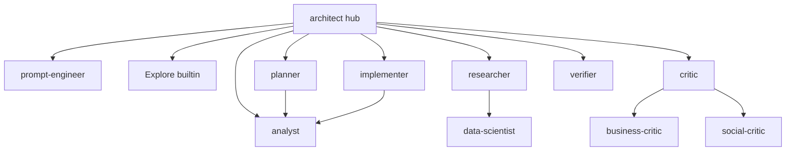

# Existing Agent-Customization Patterns Analysis — Murmuration Source Material

- **Topic:** Inventory and abstraction analysis of existing agent-customization assets across the `personal` workspace
- **Date:** 2026-06-14
- **Invoking agent:** Architect (for Murmuration framework drafting)
- **Target framework:** Murmuration — tool-agnostic, packageable multi-agent framework (bun CLI) at `/Users/cnickson/projects/murmur`
- **Status:** Complete
- **Scope note:** This report analyzes EXISTING assets only. It does not design Murmuration.

---

## 1. Agent File Format

Agent definitions live in `.github/agents/` directories at each project root and use the filename convention `<name>.agent.md`. Each file is a markdown document with a YAML frontmatter block delimited by `---` fences, followed by a prose body that defines the agent's persona, mandate, and procedure.

### Frontmatter schema (observed fields)

The following fields appear across the corpus (not all agents use all fields):

- `description` — (always present) A long single-line quoted string. Convention: begins with `"Use when: ..."` describing the trigger condition, then summarizes what the agent produces, and frequently ends with `"Use as a subagent of the <X> agent ..."` to encode topology. This field is what the parent agent's model reads to decide dispatch.
- `tools` — A YAML inline array of tool identifiers the agent is permitted to use. Two distinct notations coexist:
  - **Coarse aliases:** `tools: [read, search, edit, new, web, fetch, agent]` (used by most `personal/` and `agri/` subagents).
  - **Fully-qualified tool IDs:** `tools: [vscode/getProjectSetupInfo, read/readFile, agent/runSubagent, edit/createFile, search/textSearch, web/fetch, todo]` (used by the orchestrator agents `architect.agent.md` and `real-estate-master.agent.md`, and the real-estate specialists).
- `agents` — A YAML inline array naming the subagents this agent is allowed to dispatch (e.g. `agents: [analyst]`, `agents: [business-critic, social-critic]`). An empty roster is written explicitly as `agents: []`. The hub agents carry very large rosters.
- `model` — An array of preferred model display names, e.g. `model: ['Claude Sonnet 4.5 (copilot)', 'Claude Opus 4 (copilot)']` or `model: ['Claude Opus 4 (copilot)']`. Used to pin heavier models for critics/verifiers.
- `user-invocable` — Boolean. `false` marks an agent as dispatch-only (cannot be selected directly by the user); orchestrators omit it (defaulting to user-invocable).
- `disable-model-invocation` — Boolean, observed always `false` where present.
- `name` — Only observed in `SKILL.md` frontmatter (see §3), NOT in `.agent.md` files; the agent's identity is carried by its filename.
- `argument-hint` — **Searched for and NOT found** in any `.agent.md` file in the workspace.

The markdown body follows a consistent rhetorical structure: an `# <Name> — <Role>` H1, a bold persona sentence ("You are a **Senior Solutions Architect**..."), a `## Core Mandate` numbered list, then procedure sections (`## Your Job`, `## Output Format`, phase tables, loop limits, and `## Constraints` with `**ALWAYS** / **DO NOT**` bullets).

### Verbatim frontmatter samples

**`personal/.github/agents/architect.agent.md`** (the hub/orchestrator — fully-qualified tools):
```yaml
description: "Use when: planning, analyzing, or designing implementation strategies. Produces detailed prose-based analysis documents ... Routes coding tasks through the implementer pipeline and research tasks through the researcher writing pipeline."
tools: [vscode/getProjectSetupInfo, vscode/installExtension, vscode/newWorkspace, vscode/runCommand, read/getNotebookSummary, read/problems, read/readFile, read/viewImage, read/readNotebookCellOutput, read/terminalSelection, read/terminalLastCommand, agent/runSubagent, edit/createDirectory, edit/createFile, edit/createJupyterNotebook, edit/editFiles, edit/editNotebook, search/changes, search/codebase, search/fileSearch, search/listDirectory, search/textSearch, search/usages, web/fetch, web/githubRepo, todo]
agents: [Explore, analyst, researcher, research-critic, fact-checker, critic, business-critic, social-critic, prompt-engineer, planner, implementer, verifier, ui-ux, data-scientist, data-critic]
```

**`personal/.github/agents/planner.agent.md`** (subagent — coarse aliases, dispatch-only):
```yaml
tools: [read, search, edit, new, agent]
agents: [analyst]
user-invocable: false
disable-model-invocation: false
```

**`personal/.github/agents/verifier.agent.md`** (subagent with pinned models):
```yaml
tools: [read, search, edit, new]
model: ['Claude Sonnet 4.5 (copilot)', 'Claude Opus 4 (copilot)']
user-invocable: false
disable-model-invocation: false
```

**`personal/.github/agents/real-estate/re-fraud-detector.agent.md`** (domain specialist — fully-qualified tools, narrow roster):
```yaml
description: "Use when: fraud pattern detection is needed — scans all specialist outputs for red flags ..."
tools: [read/readFile, edit/createFile, edit/editFiles, search/textSearch, search/listDirectory, web/fetch]
agents: [re-title-analyst, re-revenue-records-expert]
user-invocable: false
disable-model-invocation: false
```

Key abstraction signal for Murmuration: the **same logical agent** (e.g. `critic`, `verifier`, `planner`) exists in three copies — `personal/`, `agri/`, `elec/` — with divergent tool notations, model pins, and (critically) divergent bodies. The frontmatter is largely portable; the body is where drift accumulates.

## 2. Instruction File Format

Instruction files live in `.github/instructions/` and use the filename convention `<name>.instructions.md`. Only **two** exist in the entire workspace:

- `personal/.github/instructions/real-estate-output-sections.instructions.md`
- `elec/.github/instructions/architect-output-sections.instructions.md`

### Frontmatter schema

The frontmatter is minimal — a single field, `applyTo`, holding a quoted glob pattern that scopes the instruction to matching file paths. There is no `description`, `tools`, or `name`. The body is the entire payload.

**`personal/.github/instructions/real-estate-output-sections.instructions.md`** (verbatim):
```yaml
---
applyTo: 'chat/thread-*-india-property/_architect/**/*.md'
---
```
Body excerpt:
> # Real Estate Advisory Output Format
> All analysis documents produced by the Real Estate Agent system must follow this structure. Sections may be omitted if genuinely irrelevant ... but the ordering must be preserved.
> ## Required Sections (in order)
> ### 1. Executive Summary ... ### 3. Legal Analysis ... ### 8. Risk Matrix ...

**`elec/.github/instructions/architect-output-sections.instructions.md`** (verbatim):
```yaml
---
applyTo: '_architect/**/*.md'
---
```
Body excerpt:
> # Architect Pipeline — Required Output Sections
> Every document you produce MUST contain ALL of the following sections in this exact order ... ### 1. Introduction ### 2. Motivation ### 3. Purpose ### 4. Analysis (at least three distinct approaches) ...

### Observations

The `applyTo` glob determines activation: the personal one scopes narrowly to a specific chat thread's output directory (`chat/thread-*-india-property/_architect/**/*.md`), while the elec one scopes to any `_architect/` markdown. Both instructions encode **output-format contracts** — the required section ordering for documents — rather than coding conventions. This is significant for Murmuration: these files demonstrate that the existing system already separates "what sections a document must contain" (instruction, path-scoped) from "how the agent thinks" (agent body). However, the separation is incomplete — much output-format guidance also lives duplicated inside agent bodies (see §6).

## 3. Skill File Format

A broad search for `**/SKILL.md` found exactly **one** file authored as a skill in the user's own assets, and it is a vendored third-party file, not part of the user's agent system:

- `gemma4-setup/llama.cpp/tools/ui/src/lib/components/app/SKILL.md`

Its frontmatter uses two fields — `name` and `description` — and the body is a flat bullet list of conventions:
```yaml
---
name: app
description: Opinionated app components building on top of ./ui primitives
---
```
Body:
> - Can include business logic and state management
> - Should use original spelling for HTML-native events and `camelCase` for custom events
> - Props and markup attributes should be listed alphabetically ...

### Observations on skill structure

The richer, directory-structured skill model is visible not in the user's authored assets but in the **VS Code Copilot runtime skills** referenced in the environment (e.g. `skills/agent-customization/SKILL.md`, `skills/project-setup-info-local/SKILL.md`). Those follow a pattern of a named directory containing a `SKILL.md` plus sibling asset files/subfolders, with frontmatter carrying `name`, `description`, and an optional `file` path that the model reads on demand. The distinction is:

- **Flat skill:** a single `SKILL.md` whose body is the entire instruction payload (the llama.cpp `app` example).
- **Directory-structured skill:** a folder (`skills/<name>/`) where `SKILL.md` is an index/description and additional assets (prompts, scripts, reference docs) live alongside it, loaded lazily.

**Critical finding for Murmuration:** the user's own multi-agent system currently has **almost no skill files**. Domain knowledge that *should* be packaged as skills is instead embedded directly in agent bodies (see §6). This is precisely the gap Murmuration intends to close — the skill format exists in the ecosystem but is essentially unused in the user's agent assets today.

## 4. Prompt File Format

A search for `**/*.prompt.md` across the workspace returned **no files**, and `**/.github/prompts/**` likewise returned nothing. The user's reusable-prompt assets therefore do not currently exist as `.prompt.md` files in this workspace.

For reference, the VS Code `.prompt.md` schema (per the `agent-customization` skill available in the environment) carries frontmatter fields such as `mode`, `description`, `tools`, and `model`, with a markdown body that may reference `${input:...}` style variables. Since none are present in the user's assets, Murmuration has a clean slate for prompt generation — there is no existing prompt convention to preserve or migrate. The closest analog to a "reusable invocation" in the current system is the `description: "Use when: ..."` trigger string in each agent, which serves the routing function that a prompt file's `description` would otherwise serve.

## 5. Subagent Invocation & Orchestration Topology

### Invocation mechanism

Subagents are invoked through the `agent/runSubagent` tool (granted in the `tools` array of orchestrator agents — present in both `architect.agent.md` and `real-estate-master.agent.md`). The set of agents an orchestrator may dispatch is declared in its `agents:` frontmatter array, and the agents are referenced **by name** (matching the `.agent.md` filename stem). The body then describes *when* and *in what order* to dispatch them. The built-in VS Code `Explore` agent is dispatched by the same `agent/runSubagent` mechanism but, per the architect body, "is a built-in VS Code Copilot agent (not a custom agent file in `.github/agents/`)."

### The `architect` orchestrator (closest analog to Murmuration's "master agent")

`personal/.github/agents/architect.agent.md` is the canonical hub. It documents a **selective dispatch model** ("not a fixed chain. The Architect is the central hub — all decisions flow through it"). Its body encodes:

- An **Available Agent Roster** ASCII tree listing 15 subagents (`prompt-engineer`, `Explore`, `analyst`, `researcher`, `research-critic`, `fact-checker`, `data-scientist`, `data-critic`, `ui-ux`, `critic`, `business-critic`, `social-critic`, `planner`, `implementer`, `verifier`).
- A **Selective Dispatch Principle** table mapping each agent to "Invoke WHEN / Skip WHEN" conditions.
- **Parallel Dispatch Rules** (e.g. "Multiple Explore agents — max 3 concurrent"; "business-critic + social-critic — 2 concurrent"; "critic + planner — NEVER parallel, always sequential").
- **Loop Limits** as a hard-cap table (e.g. "Critic ↔ Planner: min 1, max 3, early exit when all dimensions ≥4").
- A **Decision Authority** clause ("The Architect makes all final decisions ... may override any subagent recommendation with explicit justification").
- Two task-class pipelines: CODING (Phases 1–5) and RESEARCH (Phases R1–R5).

Subagents themselves can be sub-orchestrators: `critic.agent.md` carries `agents: [business-critic, social-critic]` and a "Specialized Subagent Reviews — Parallel Fan-Out" section that mandates dispatching both in parallel and appending a "Multi-Critic Scorecard." `planner`, `researcher`, and `implementer` each carry `agents: [analyst]` or `agents: [data-scientist]` for targeted callbacks. This yields a **multi-tier dispatch tree**, not a flat hub-and-spoke.

### The `real-estate-master` orchestrator

`personal/.github/agents/real-estate/real-estate-master.agent.md` is a second, domain-specific hub that "orchestrate[s] a team of 31 specialized subagents." Its `agents:` array names all 31 (`re-query-classifier`, `re-legal-researcher`, ... `re-verifier`). The body documents a tiered topology (TIER 0 classification → TIER 1 research, max 4 concurrent → TIER 2 domain specialists → TIER 3 critics/fraud → synthesis → report/verify). It mirrors the architect's structure (phases, parallel caps, selective dispatch) but with a domain-specific roster.

### Topology summary



This architect orchestration is the existing pattern most analogous to Murmuration's intended "master agent": a single hub that holds the routing logic, dispatch caps, and loop limits, delegating specialized work to named, dispatch-only subagents.

## 6. Codebase-Specific Context Leakage

This is the central anti-pattern Murmuration aims to fix, and the evidence is strong. Project-specific facts currently live **predominantly inside agent bodies**, not in instructions or skills. Of the three context locations the system theoretically supports, only the weakest (agent bodies) is heavily used:

- **Instructions:** Only 2 files exist (§2), each carrying output-format contracts — a small fraction of total project context.
- **Skills:** Effectively 0 user-authored skills (§3).
- **Agent bodies:** Saturated with domain facts.

### Evidence of leakage (verbatim, with file paths)

The `agri/` agents are the clearest case — generic-named agents are rewritten with AgriRide/farmer domain knowledge baked into the prose:

- `agri/.github/agents/social-critic.agent.md` (line 11): *"You are reviewing plans for **AgriRide** — an on-demand agricultural machinery aggregator platform."* The persona is hard-coded to "smallholder farmers, landless labourers, and below-poverty-line (BPL) families in rural India."
- `agri/.github/agents/critic.agent.md` embeds dozens of domain-specific review items, e.g. line 30: *"authentication and authorization boundaries ... for every endpoint and user role (farmer, operator, machinery owner, admin, support)"*; line 44: *"Payment fraud patterns specific to agricultural marketplaces ... fake bookings to drain escrow accounts, operator-farmer collusion ..."*; line 118: *"Rice paddies in Tamil Nadu require different machinery ... than wheat fields in Punjab ..."*
- `agri/.github/agents/data-scientist.agent.md` (line 32): *"This project is a greenfield agricultural machinery aggregator platform (AgriRide). Known and expected data sources: ... Farmer and operator demographics ..."*
- `personal/.github/agents/real-estate/*` — the entire 32-agent cluster (`re-fraud-detector` GPA/benami/patta fraud checklists, `re-rera-specialist`, `re-revenue-records-expert`) hard-codes Indian-real-estate domain knowledge into agent bodies that, structurally, are identical archetypes to the generic `critic`/`verifier`/`researcher`.

### Quantification

Comparing the **same logical agent** across projects reveals the magnitude:

- The generic `personal/.github/agents/critic.agent.md` and the `agri/.github/agents/critic.agent.md` share frontmatter and skeletal section structure, but the agri version's 11-dimension review checklist is rewritten almost entirely in AgriRide/farmer terms. Roughly the **first ~150 lines of domain-review content are project-specific** while the orchestration scaffolding (loop limits, scorecard format, subagent fan-out) is generic.
- `social-critic` diverges even more — the personal and agri versions share the `description` verbatim but the body persona and every review question are domain-bound.
- The real-estate cluster is **100% domain-specific bodies** — there is no generic counterpart; each `re-*` agent is a domain specialization of an archetype (researcher, analyst, critic, verifier, synthesizer, report-generator).

**Estimate:** In the orchestrator and critic-family agents, roughly **40–70% of body content is project-specific** and would, under Murmuration's model, belong in skills/instructions. In the real-estate specialist cluster the figure approaches **100%**. Only the frontmatter, the dispatch/loop scaffolding, and the `## Constraints` boilerplate are cleanly generic and reusable across projects today. This duplication-with-drift across `personal/`, `agri/`, and `elec/` copies is the maintenance burden the framework targets.

## 7. Count & Inventory

Counts derived from directory listings and `file_search` across the workspace.

### Agent files (`*.agent.md`) — 71 total

| Project | Location | Count | Notable agents |
|---------|----------|-------|----------------|
| personal (core) | `.github/agents/` | 17 | architect (hub), analyst, planner, implementer, researcher, critic, business-critic, social-critic, research-critic, fact-checker, verifier, data-scientist, data-critic, ui-ux, prompt-engineer, politician, finance-analyst |
| personal (real-estate) | `.github/agents/real-estate/` | 32 | real-estate-master (hub) + 31 `re-*` specialists |
| agri | `agri/.github/agents/` | 12 | architect, analyst, planner, implementer, critic, business-critic, social-critic, verifier, data-scientist, data-critic, ui-ux, prompt-engineer |
| elec | `elec/.github/agents/` | 10 | architect, analyst, planner, implementer, critic, verifier, data-scientist, data-critic, ui-ux, prompt-engineer |

personal total = 17 + 32 = **49**; agri = **12**; elec = **10**; grand total = **71**.

### Instruction files (`*.instructions.md`) — 2 total

| Project | File |
|---------|------|
| personal | `.github/instructions/real-estate-output-sections.instructions.md` |
| elec | `.github/instructions/architect-output-sections.instructions.md` |

### Skill files (`SKILL.md`) — 1 total (vendored, not user agent system)

| Project | File |
|---------|------|
| gemma4-setup (third-party) | `gemma4-setup/llama.cpp/tools/ui/src/lib/components/app/SKILL.md` |

### Prompt files (`*.prompt.md`) — 0 total

None found in the workspace.

### Observations

- The agent layer is **massively over-weighted** (71 files) relative to instructions (2) and skills (0 user-authored) — confirming that nearly all context lives in agents (§6).
- A **core archetype set** — architect, analyst, planner, implementer, critic, verifier, data-scientist, data-critic, ui-ux, prompt-engineer — recurs in all three project agent folders (personal, agri, elec), making it the natural candidate for Murmuration's generic base library.
- The two domain clusters (agri's farmer-marketplace variants; personal's 32-agent real-estate system) represent **specializations** that should be expressed as skills/instructions layered over the generic archetypes.

## 8. Packaging Signals

Two established conventions exist in the workspace for Murmuration's bun CLI packaging to follow.

### `agri/package.json` — bun + turborepo monorepo

```json
{
  "name": "agriride",
  "private": true,
  "workspaces": ["apps/*", "packages/*", "packages/config/*"],
  "devDependencies": { "turbo": "^2.5.0", "@commitlint/cli": "^19.8.0", ... },
  "scripts": {
    "build": "turbo run build",
    "dev": "turbo run dev",
    "lint": "turbo run lint",
    "test": "turbo run test",
    "typecheck": "turbo run typecheck",
    "api:generate": "... bunx orval"
  }
}
```
Signals: uses **npm/bun `workspaces`** for monorepo structure, **turbo** for task orchestration, **`bunx`** to invoke binaries, and conventional-commits tooling (`@commitlint`, plus a `lefthook.yml` and `commitlint.config.mjs` at the agri root). Standard script names: `build`, `dev`, `lint`, `test`, `typecheck`.

### `calebjebadurai.com/package.json` — single TS/Next project

```json
{
  "name": "calebjebadurai.com",
  "version": "1.0.0",
  "private": true,
  "scripts": { "dev": "...", "build": "...", "lint": "next lint", "sync-cv": "bash scripts/sync-cv.sh" },
  "devDependencies": { "typescript": "^5.7.0", "@types/node": "^22.0.0", "eslint": "^9.0.0", ... }
}
```
Signals: TypeScript `^5.7`, `@types/node ^22`, ESLint `^9`, a `scripts/` directory for shell helpers, and `version` + `private` fields.

### `tsconfig` and `bin`

- No top-level `tsconfig.json` was read in detail, but `calebjebadurai.com/tsconfig.json` and `agri/tsconfig` (via `turbo typecheck`) exist, establishing TS ^5.7 as the baseline.
- **No existing project defines a `bin` entry** — none of the inventoried `package.json` files expose a CLI binary. Murmuration's `bin` field (the bun CLI entry point) would be a new convention, but should align with the observed style: `private`/`version` fields, `scripts` named `build`/`dev`/`lint`/`test`/`typecheck`, and shell helpers under `scripts/`.

### Other build conventions observed

- `chat/build.py` is a standalone Python compiler that walks markdown directories, strips frontmatter via regex (`re.sub(r'^---.*?---\n', '', text, flags=re.DOTALL)`), and renders to HTML — an existing example of the "compile markdown assets into an output artifact" pattern that Murmuration's compile step mirrors conceptually.
- Repeated `_architect/` output-directory convention across projects (personal, agri, elec all have one) — a strong workspace-wide convention Murmuration should respect for any generated artifacts.

## Summary

- **Agent format:** `.github/agents/<name>.agent.md` — YAML frontmatter (`description` with a `"Use when: ..."` trigger, `tools`, `agents`, `model`, `user-invocable`, `disable-model-invocation`) + prose body (persona, mandate, phases, loop limits, constraints). `argument-hint` not used; identity comes from filename. Two tool notations coexist: coarse aliases (`read, search, edit, new, agent`) and fully-qualified IDs (`agent/runSubagent`, `search/textSearch`).
- **Instructions:** only 2 files; minimal frontmatter (`applyTo` glob only); both encode output-section contracts.
- **Skills:** effectively 0 user-authored (`name`+`description` frontmatter); the format is barely used despite being the intended home for domain context.
- **Prompts:** 0 `.prompt.md` files — clean slate.
- **Orchestration:** `architect.agent.md` is the closest analog to Murmuration's master agent — a hub with selective dispatch tables, parallel caps, loop limits, and a 15-agent roster invoked via `agent/runSubagent`; subagents (critic→business/social-critic, planner→analyst) form a multi-tier tree. `real-estate-master` is a parallel 31-agent domain hub.
- **Anti-pattern (key finding):** project context lives almost entirely in agent **bodies**, not skills/instructions. agri agents hard-code AgriRide/farmer facts; the 32 `re-*` agents are ~100% Indian-real-estate domain. ~40–70% of critic/orchestrator body content is project-specific; the same archetypes are duplicated-with-drift across personal/agri/elec.
- **Inventory:** 71 agents (personal 49, agri 12, elec 10), 2 instructions, 1 vendored skill, 0 prompts. A 10-agent core archetype set recurs in all three projects → natural generic base library.
- **Packaging:** follow agri's bun/turbo `workspaces` + standard scripts (`build`/`dev`/`lint`/`test`/`typecheck`, `bunx`) and TS ^5.7 baseline; no existing `bin` entry, so the CLI binary is a new convention. `chat/build.py` shows the existing markdown-compile pattern; `_architect/` is the workspace-wide output convention.

**Report saved to:** `_architect/research/2026-06-14-murmur-existing-patterns-analysis.md`
